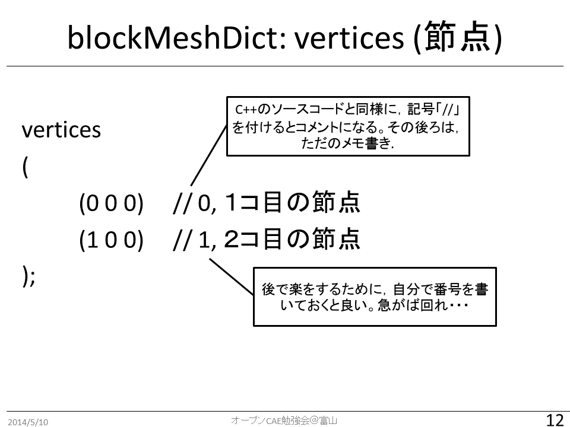
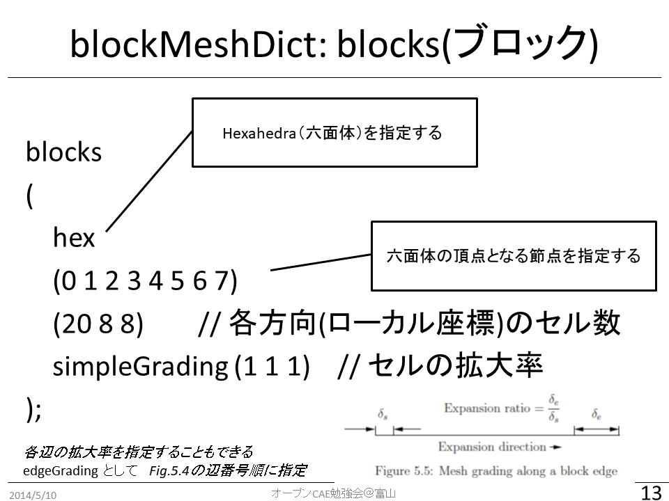
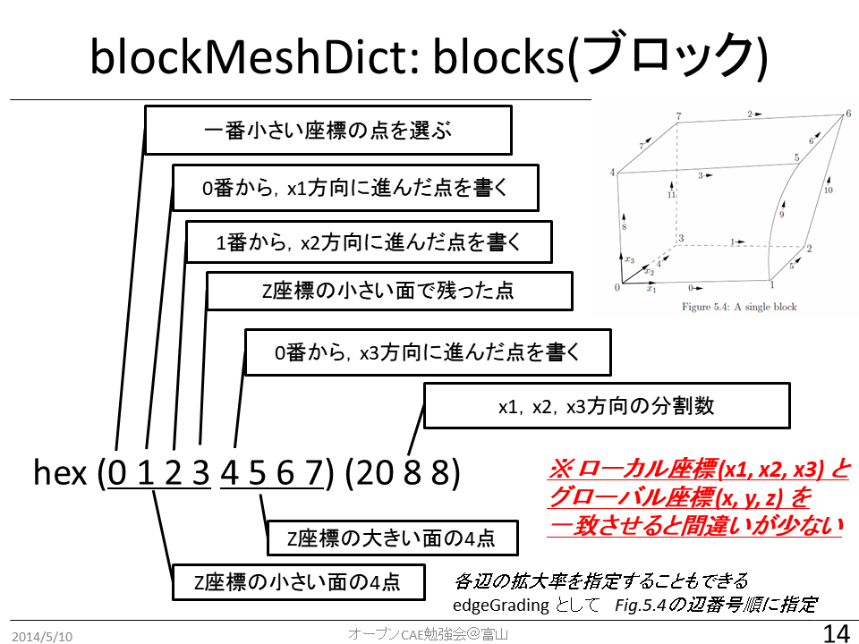
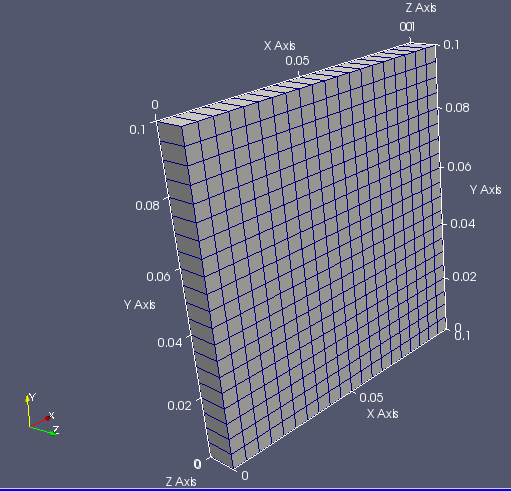
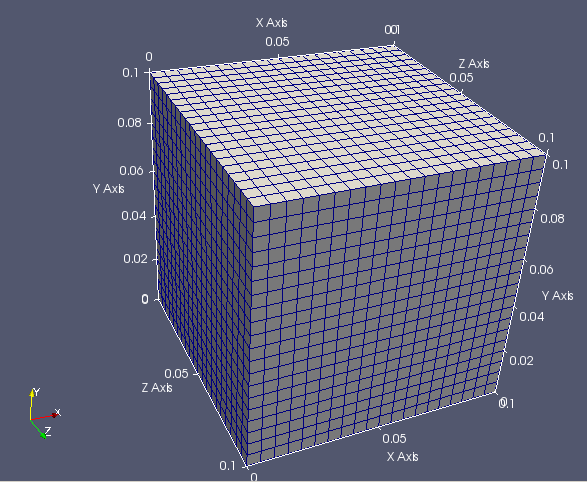
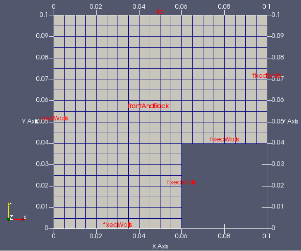
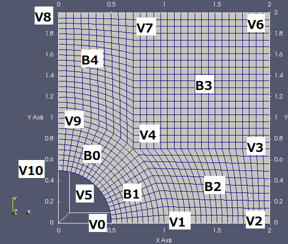

## blockMesh - icoFoam/cavity例題集を使って

blockMesh は，もっとも基本的なメッシュ生成ユーティリティである。設定ファイルを細かく記述すれば，思い通りにコントロールしてメッシュを生成することも可能である。しかし，かなり煩雑は作業となるため，事前に入念な準備・設計が必要である。

次の章で使用するsnappyHexMeshユーティリティでも，まずはじめにblockMeshを実行する必要がある。

この章では，OpenFOAM付属の標準例題であるicoFoam/cavity例題を用いて，blockMeshの基本的な使い方を学ぶ。

### icoFoam/cavity例題集

$FOAM_TUTORIALS/incompressible/icoFoam/cavity/に含まれるファイルの情報を確認するため，下記のコマンドを実行する．（treeコマンドの実行）

> cd $FOAM_TUTORIALS/incompressible/icoFoam/cavity/
>
> tree

実行結果は次の通りである。

```
user@user-VirtualBox:~/OpenFOAM/OpenFOAM-v1812/tutorials/incompressible/icoFoam/cavity$ tree
.
├── Allclean
├── Allrun
├── cavity
│   ├── 0
│   │   ├── p
│   │   └── U
│   ├── constant
│   │   └── transportProperties
│   └── system
│       ├── blockMeshDict
│       ├── controlDict
│       ├── fvSchemes
│       └── fvSolution
├── cavityClipped
│   ├── 0
│   │   ├── p
│   │   └── U
│   ├── constant
│   │   └── transportProperties
│   └── system
│       ├── blockMeshDict
│       ├── controlDict
│       ├── fvSchemes
│       ├── fvSolution
│       └── mapFieldsDict
└── cavityGrade
    ├── 0
    │   ├── p
    │   └── U
    ├── constant
    │   └── transportProperties
    └── system
        ├── blockMeshDict
        ├── controlDict
        ├── fvSchemes
        ├── fvSolution
        └── mapFieldsDict

12 directories, 25 files
```

このcavityディレクトリ内には，3つ（cavity cavityGrade cavityClipped）の例題が含まれている。Allrunスクリプトを実行した場合には，cavityケースを複製（clone）した後に改造する2つ（cavityFine cavityHighRe）の例題も生成される。よって，合計5つの例題が含まれている。

### cavity例題集の作業ディレクトリへのコピー

ユーザーの作業ディレクトリ（＄FOAM_RUN）に，cavity例題集をコピーする。

GUIで操作する場合には，ファイルマネージャーを起動し，$FOAM_TUTORIALS/incompressible/icoFoam/cavity ディレクトリをコピーし，$FOAM_RUNへペーストする。

コマンドラインで操作する場合には，下記を実行する。2つめのコマンドの最後には，スペースとピリオドがあることに注意してください．

> cd $FOAM_RUN
>
> cp -r $FOAM_TUTORIALS/incompressible/icoFoam/cavity/   .

### cavity/cavity 例題のblockMeshDict の確認

ファイルマネージャーで，$FOAM_RUN/cavity/cavity まで移動し，blockMeshDictをダブルクリックして開く。

```
scale 0.1;

vertices
(
    (0 0 0)  //節点0
    (1 0 0)
    (1 1 0)
    (0 1 0)
    (0 0 0.1)
    (1 0 0.1)
    (1 1 0.1)
    (0 1 0.1) //節点7
);

blocks
(
    hex (0 1 2 3 4 5 6 7) (20 20 1) simpleGrading (1 1 1)  //block0
);

edges
(
);

boundary
(
    movingWall
    {
        type wall;
        faces
        (
            (3 7 6 2)
        );
    }
    fixedWalls
    {
        type wall;
        faces
        (
            (0 4 7 3)
            (2 6 5 1)
            (1 5 4 0)
        );
    }
    frontAndBack
    {
        type empty;
        faces
        (
            (0 3 2 1)
            (4 5 6 7)
        );
    }
);

mergePatchPairs
(
);
```

#### blockMesh用設定ファイル blockMeshDict
blockMeshDictディクショナリの基本構造は次の通りである。

- scale スケール変換の係数
    - 節点の座標に与えた数字に，この変換係数を掛けた値が使用される
        - OpenFOAM内部では，長さの基本単位は m である．
        - たとえば，mm単位で記入するとき，この係数を0.001とする

- vertices　節点．3次元座標を与える
- blocks　ブロック
- edges　辺（円弧やスプラインの種類と通過点を指定する）
- patches　面に関する情報（境界条件）
- mergePatchPairs  ブロック間の面を結合したい場合に指示する

blockMeshDictディクショナリの作成時には，次のことに気をつけると良い。

- 設計図をしっかりと描く！

- ブロック作成時に，点の順番を意識する！
    1. x座標（ローカル座標１）が増える，
    2. y座標（ローカル座標２）が増える，
    3. z座標（ローカル座標３）が増える。

- Dict を見やすく書く。
    - 正確なインデント，
    - 適切なコメント，など。

- 括弧 () の前には，空白を入れる．

blockMeshDictの書き方に，いくつかの方法が挙げられる。

-  数字を直接書き込む （変数も使用可）
    - 基本
    - 形状変更時に手間がかかる
-  マクロ言語プロセッサ m4 を利用して，汎用化
    - blockMeshDict を生成するためのファイルを作成
    - 形状変更等が容易になる
-  Dictionary に コード（プログラム）を書いて，汎用化
-  プログラム・スクリプトを作成して生成する

##### blockMeshDict: vertices (節点)

３次元座標で点の位置を指定する。始めに指定した点が０番となり，順に増える番号が内部で付与される。後の設定では，この節点番号で点を指示する。

|  |
| :--------------------------------------: |
|        図 　blockMeshDict: vertices        |

##### blockMeshDict: blocks(ブロック)

6面体としてブロックを定義する。hexのあとに，6面体の頂点となる節点の番号を列記する。前述の通り，点の指定順によって，ブロック内でのローカルな座標系が決定される。

各方向（ローカル座標）のセル数と拡大率を指定する。拡大率は，座標が最大であるセルの大きさ／座標が最小であるセルの大きさとして定義される。

|  |
| :--------------------------------------: |
|  |
|         図 　blockMeshDict: blocks         |

##### blockMeshDict: edges (線)

2つの節点間を結ぶ線の種類を指定できる。指定をしなければ、直線で結ばれる。下記の種類が選択可能である。

| 指定するキーワード | 説明      | 追加で指定する情報 |
| --------- | ------- | --------- |
| arc       | 円弧      | 途中の1点     |
| spline    | スプライン曲線 | 途中の点のリスト  |
| polyLine  | 多角線     | 途中の点のリスト  |

##### blockMeshDict: boundary (境界面)

境界面には，任意の名前を付ける。ただし，他のファイルの情報（boundary, U, p など）と一致させる必要がある。条件指定時に正規表現が使えるため，同じ条件を付与する面には部分一致する名前を付けるなどの工夫をすると良い。

typeキーワードに続けて，境界条件に応じた型を与える。

面は，4つの節点で指定する。１つの名前に，複数の面をまとめて指定できる。


#### blockMesh の実行

cavity/cavity ディレクトリから端末を起動する。of1812を有効にして，blockMeshを実行する。

ファイルマネージャーで，`$FOAM_RUN`/cavity/cavityまで移動する。ファイルマネージャー上で右クリックして，「Open Terminal Here」をクリックして端末を起動する。

端末で，下記コマンドを実行し，OpenFOAM v1812を有効にする．
> of1812

メッシュ生成ユーティリティblockMeshを実行する。
> blockMesh

端末に実行結果が表示される。エラーメッセージが表示されていないか，確認する。

#### paraFoam の実行とメッシュの確認

可視化ソフトを起動するため，paraFoamを実行する。

> paraFoam

ParaViewが起動したら，緑色になっているApplyボタンをクリックする。「Surface with Edges」形式で表示することで，作成されたメッシュが確認できる。

|  |
| :--------------------------------------: |
|       図 　mesh from cavity tutorial       |

#### blockMeshDict 内での変数利用方法の説明

blockMeshDict では，数字を直接書く代わりに，変数を使用することができる。

変数に値をセットする方法：設定ファイル内では，次のように，変数名と数字を並べて書き，間には空白を入れる。数字の後ろにはセミコロンを入れる。

```
xMax 0;
```

変数を使う時には，変数名の前に$を追加する。

```
$xMax
```

この記述方法を使って，もとのblockMeshDictを次のように書き換える。

```blockMeshDict改造例
scale 0.1;

xMin 0;  xMax 1;    Nx 20;  //dx=0.05
yMin 0;  yMax 1;    Ny 20;  //dy=0.05
zMin 0;  zMax 0.1;  Nz 1;   //dz=0.1

vertices
(
    // zMin plane
    ($xMin $yMin $zMin)  // v0
    ($xMax $yMin $zMin)
    ($xMax $yMax $zMin)
    ($xMin $yMax $zMin)

    // zMax plane
    ($xMin $yMin $zMax)  // v4
    ($xMax $yMin $zMax)
    ($xMax $yMax $zMax)
    ($xMin $yMax $zMax)
);

blocks
(
    hex (0 1 2 3 4 5 6 7) ($Nx $Ny $Nz) simpleGrading (1 1 1)
);

以下は変更なし
```

先ほどと同様に，blockMesh を実行し，paraFoam でメッシュを確認する。実行時にエラーメッセージが表示されていないかも確認する。

##### z方向のサイズを他と同じ大きさ，分割数に変更してメッシュを生成する。

変数を使用すると，メッシュの変更が容易になる。例えば，z方向の大きさを変更して，計算領域を立方体とするには，次のように，zMaxとNzを書き換える。

```blockMeshDict改造例
scale 0.1;

xMin 0;  xMax 1;    Nx 20;  //dx=0.05
yMin 0;  yMax 1;    Ny 20;  //dy=0.05
zMin 0;  zMax 1;    Nz 20;  //dz=0.05

以下は変更なし
```

2箇所を書き換えるだけで，下記のメッシュが生成できる。

|  |
| :--------------------------------------: |
| 図 　z-extended mesh from cavity tutorial  |

計算領域の大きさ，分割数などを変更して，いろいろなメッシュを生成し，確認してみる。

#### Grading（引き寄せ）の設定（各自で挑戦）

ここまでは，等間隔メッシュを作成した。シミュレーションでは，物理量の変化が激しい場所には，細かなメッシュを使用することが望ましい。そのために，生じる物理現象を予想し，物理量の変化の激しい部分に細かなメッシュを作成する。

［やってみよう］simpleGrading の設定を変更してみる。例えば，y方向を0.5にする。

［やってみよう］simpleGrading に変わって，edgeGrading (1 1 1 1 0.5 0.5 0.5 0.5 1 1 1 1)とする。先と同じ。

［やってみよう］simpleGrading に変わって，edgeGrading (1 1 1 1 1 0.4 0.4 1 1 1 1 1)とする。lid側だけが寄せられる。

［やってみよう］さらには，Multi-gradingを試す。

```
    simpleGrading
    (
        1 // x-direction expansion ratio
        (
            (0.2 0.3 4) // 20% y-dir, 30% cells, expansion = 4
            (0.6 0.4 1) // 60% y-dir, 40% cells, expansion = 1
            (0.2 0.3 0.25) // 20% y-dir, 30% cells, expansion = 0.25 (1/4)
        )
        3 // z-direction expansion ratio
    )
```

### cavity/cavityClipped 例題

cavity/cavityClipped ディレクトリへ移動

blockMeshDict の確認

　　　　特徴：マルチブロック（face matching型）

blockMesh の実行

paraFoam の実行とメッシュの確認

|  |
| :--------------------------------------: |
|   図 　mesh from cavityClipped tutorial    |


```
scale 0.1;

xMin 0; xMid 0.6; xMax 1;  Nx1 12; Nx2 8;
yMin 0; yMid 0.4; yMax 1;  Ny1 12; Ny2 8;
zMin 0; zMax 0.1;           Nz 1;

vertices
(
    ($xMin $yMin $zMin)  // v0
    ($xMid $yMin $zMin)
    ($xMin $yMid $zMin)
    ($xMid $yMid $zMin)
    ($xMax $yMid $zMin)  // v4
    ($xMin $yMax $zMin)
    ($xMid $yMax $zMin)
    ($xMax $yMax $zMin)

    ($xMin $yMin $zMax)  // v8
    ($xMid $yMin $zMax)
    ($xMin $yMid $zMax)
    ($xMid $yMid $zMax)
    ($xMax $yMid $zMax)  // v12
    ($xMin $yMax $zMax)
    ($xMid $yMax $zMax)
    ($xMax $yMax $zMax)

);

blocks
(
    hex (0 1 3 2 8 9 11 10) ($Nx1 $Ny2 $Nz) simpleGrading (1 1 1)
    hex (2 3 6 5 10 11 14 13) ($Nx1 $Ny1 $Nz) simpleGrading (1 1 1)
    hex (3 4 7 6 11 12 15 14) ($Nx2 $Ny1 $Nz) simpleGrading (1 1 1)
);

edges
(
);

boundary
(
    lid
    {
        type wall;
        faces
        (
            (5 13 14 6)
            (6 14 15 7)
        );
    }
    fixedWalls
    {
        type wall;
        faces
        (
            (0 8 10 2)
            (2 10 13 5)
            (7 15 12 4)
            (4 12 11 3)
            (3 11 9 1)
            (1 9 8 0)
        );
    }
    frontAndBack
    {
        type empty;
        faces
        (
            (0 2 3 1)
            (2 5 6 3)
            (3 6 7 4)
            (8 9 11 10)
            (10 11 14 13)
            (11 12 15 14)
        );
    }
);

mergePatchPairs
(
);
```

### cavityClipped 例題の改造（mergePatchの使用）

cavity/cavityClipped ディレクトリへ移動

blockMeshDict の変更

　　　　特徴：マルチブロック（face merging型）

```
scale 0.1;

xMin 0; xMid 0.6; xMax 1;  Nx1 12; Nx2 8;
yMin 0; yMid 0.4; yMax 1;  Ny1 12; Ny2 8;
zMin 0; zMax 0.1;           Nz 1;

vertices
(
    ($xMin $yMin $zMin)  //0
    ($xMid $yMin $zMin)
    ($xMin $yMid $zMin)  //2
    ($xMid $yMid $zMin)

    ($xMax $yMid $zMin)  //4
    ($xMin $yMax $zMin)
    ($xMid $yMax $zMin)  //6
    ($xMax $yMax $zMin)

    ($xMin $yMin $zMax)  //8
    ($xMid $yMin $zMax)
    ($xMin $yMid $zMax)  //10
    ($xMid $yMid $zMax)

    ($xMax $yMid $zMax)  //12
    ($xMin $yMax $zMax)
    ($xMid $yMax $zMax)  //14
    ($xMax $yMax $zMax)

    // for merged
    ($xMin $yMid $zMin)  //2=16
    ($xMax $yMid $zMin)  //4=17
    ($xMin $yMid $zMax)  //10=18
    ($xMax $yMid $zMax)  //12=19
);

blocks
(
    //block 0: bottom block
    hex (0 1 3 2 8 9 11 10) ($Nx1 $Ny2 $Nz) simpleGrading (1 1 1)
    //block 1: top block
    hex (16 17 7 5 18 19 15 13) ($Nx1 $Ny1 $Nz) simpleGrading (1 1 1)
);

edges
(
);

boundary
(
    inner-bottom //top of bottom block, inner-face
    {
        type patch;
        faces
        (
            (3 2 10 11)
        );
    } 
    fixedWalls-mid //bottom of top block, inner-face and wall
    {
        type wall;
        faces
        (
            (17 16 18 19)
        );
    }
    lid
    {
        type wall;
        faces
        (
            (5 7 15 13)
        );
    }
    fixedWalls
    {
        type wall;
        faces
        (
            (0 8 10 2) //bottom left
            (3 11 9 1)  // bottom right
            (1 9 8 0)  // bottom bottom
            (16 5 13 18) // top left
            (17 7 15 19) // top right
        );
    }
    frontAndBack
    {
        type empty;
        faces
        (
            (0 2 3 1)
            (8 9 11 10)
            (16 17 7 5)
            ( 18 19 15 13)
        );
    }
);

mergePatchPairs
(
    (inner-bottom fixedWalls-mid )
);
```

blockMesh を実行する．

計算実行時には，controlDict の開始時刻，終了時刻を修正し，pとUファイルの固定壁面のパッチ名を次のように変更する．正規表現を使って，fixedWallsとfixedWalls-midという2つのパッチに同じ条件を与えるためである。

```
"fixedWalls.*" //fixedWalls`
```

paraFoam を実行し，メッシュを確認する．


### 少し複雑なメッシュの例

#### 円と四角の混在

円に沿った形状
/opt/openfoam4/tutorials/stressAnalysis/solidDisplacementFoam/plateHole/

5つのブロックで構成する。edge指定によって，円弧を作成する。

|  |
| :--------------------------------------: |
|     図 　mesh from plateHole tutorial      |

斜め（ｘ，ｙ，ｚ軸と直交しない）メッシュの場合，指定する分割数はどのように解釈されるだろうか？全体座標系（ｘ，ｙ，ｚ軸）と局所座標系（そのブロックに対するｘ1，ｘ2，ｘ3軸）との関係について，理解が必要である。ブロックを構成する時に指定する節点の順番によって，これらの関係が定められる。

詳細はUser Guide 4.3 Mesh generation with the blockMesh utility を参照のこと．

https://www.openfoam.com/documentation/user-guide/blockMesh.php#x13-410004.3

