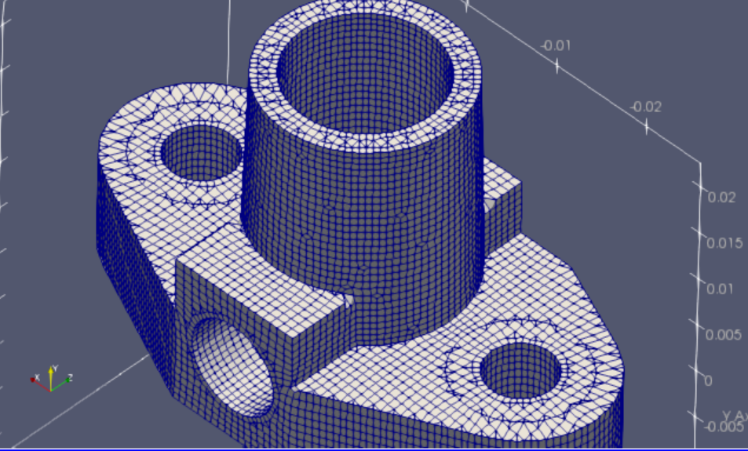

# OpenFOAMによるOpenFOAMのためのメッシュ生成（はじめの一歩）
#### June 15, 2019; OpenCAE勉強会＠富山
#### 中川慎二（富山県立大学）[Shinji NAKAGAWA，Toyama Prefectural University]  


# cfMesh

例題ディレクトリ

`/home/user/OpenFOAM/OpenFOAM-v1812/modules/cfmesh/tutorials/`

`snappyHexMesh` と同様なメッシュを生成するためには， `cartesianMesh` コマンドを実行する。その2次元メッシュ用が `cartesian2DMesh` である。

このほかに，tetrahedralメッシュを作成するための `tetMesh` コマンド，polyhedralメッシュを作成するための `pMesh` コマンドが存在する。

## cfMesh の設定ファイル meshDict

`cfMesh` の設定は，`system/meshDict` ファイルに記載する。

必須記載事項は次の通りである。
- surfaceFile: 形状を表すファイルを指定する
- maxCellSize: 基準となるセルの大きさを指定する

このほかに，細分化，境界層レイヤーなどを指定できる。

## cfMesh/cartesianMeshの標準例題 elbow_90degree

`/home/user/OpenFOAM/OpenFOAM-v1812/modules/cfmesh/tutorials/cartesianMesh/elbow_90degree/`

`Allrun` の内容は次の通りである。

```sh
#!/bin/sh
cd ${0%/*} || exit 1                        # Run from this directory
. $WM_PROJECT_DIR/bin/tools/RunFunctions    # Tutorial run functions

runApplication cartesianMesh
runApplication checkMesh -constant

#------------------------------------------------------------------------------
```


`system/meshDict` の内容は次の通りである。

```c++
surfaceFile "elbow_90degree.stl";
minCellSize 1.0;
maxCellSize 5.0;
boundaryCellSize 3.0;

localRefinement
{
    "ringArea.*"
    {
        cellSize 0.2;
    }
}

boundaryLayers
{
    nLayers 5;
    thicknessRatio 1.1;
    maxFirstLayerThickness 0.5;
}

renameBoundary
{
    defaultName     fixedWalls;
    defaultType     wall;

    newPatchNames
    {
        "inlet.*"
        {
            type    patch;
            newName inlet;
        }

        "outlet.*"
        {
            type    patch;
            newName outlet;
        }
    }
}
```

|  |
| :--------------------------------------: |
|     図 　cfMesh_elbow_zCenterSlice      |


## elbow_90degree 例題を簡単な設定で実行してみる

>
>cp system/meshDict system/meshDict.orig

`system/meshDict` の内容を，下記の通りとして実行してみる。

```c++
surfaceFile "elbow_90degree.stl";
maxCellSize 5.0;
boundaryCellSize 3.0;
```


|  |
| :--------------------------------------: |
|     図 　cfMesh_elbow_simpleSetting      |


boundaryCellSize を少し小さくする。

|  |
| :--------------------------------------: |
|     図 　cfMesh_elbow_simpleSetting      |


局所的細分化の適用例

```c++
surfaceFile "elbow_90degree.stl";
maxCellSize 5.0;
boundaryCellSize 2.0;
localRefinement
{
    "ringArea.*"
    {
        cellSize 1; //0.5; //0.2;
    }
}
```

|  |
| :--------------------------------------: |
|     図 　cfMesh_elbow_cfMesh_elbow_ringRefinement      |


## 新たなメッシュ作成に挑戦

`$WM_PROJECT_DIR/modules/cfmesh/tutorials/cartesianMesh/asmoOctree/` をコピーし，実行ディレクトリ  `$FOAM_RUN` へ`flange_cfMesh`として貼付ける。
`snappyHexMesh/flange` 例題の`flnge.stl`を，この`$FOAM_RUN/flange_cfMesh`へコピーする。

> of1812

> cp -r $WM_PROJECT_DIR/modules/cfmesh/tutorials/cartesianMesh/asmoOctree/  $FOAM_RUN/flange_cfMesh

> cp $FOAM_TUTORIALS/resources/geometry/flange.stl.gz  $FOAM_RUN/flange_cfMesh/

> uncompress $FOAM_RUN/flange_cfMesh/flange.stl.gz

> cd $FOAM_RUN/flange_cfMesh

`meshDict` を次のように修正

```c++
surfaceFile "flange.stl"; //"geom.stl";
maxCellSize 0.003;
boundaryCellSize 0.001; 
```

`cartesianMesh` を実行する。

作成されたメッシュを確認する。

|  |
| :--------------------------------------: |
|     図 　flange_cfMesh      |


## 特徴線を考慮した作業: surfaceFeatureEdges

`surfaceFeatureEdges` ユーティリティを使用し，stlファイルから特徴線を抽出し，fmsファイルを作成する。下記コマンドを実行する。

> surfaceFeatureEdges flange.stl flange.fms

fmsファイルを使用するように，`meshDict` を修正する。

```c++
//surfaceFile "flange.stl"; //"geom.stl";
surfaceFile "flange.fms";
maxCellSize 0.003;
boundaryCellSize 0.001;
```

`cartesianMesh` でメッシュを作成する。

|  |
| :--------------------------------------: |
|     図 　flange_cfMesh_withFMS      |


## cfMeshの制限

cfMesh では，複数領域のメッシュを直接作成することができない。snappyHexMesh と比較したときの欠点である。

複数領域から構成される領域を作成したい場合には，各領域ごとにcfMeshなどを利用してメッシュを作成し，結合する必要がある。


## [目次へ戻る](index_j.md)