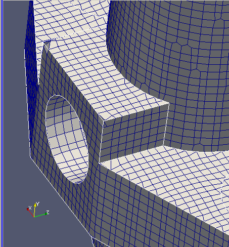

# OpenFOAMによるOpenFOAMのためのメッシュ生成（はじめの一歩）
#### June 15, 2019; OpenCAE勉強会＠富山
#### 中川慎二（富山県立大学）[Shinji NAKAGAWA，Toyama Prefectural University]  


# 1. snappyHexMesh

`snappyHexMesh` では，複雑な形状に沿ったメッシュを作成できる。用意するものは，形状を表すファイル（STL形式など），ベースとなる六面体メッシュ（`blockMesh` で作成），設定ファイル（`snappyHexMeshDict` ）である。

`snappyHexMesh` の設定は，非常に多くの項目が存在する。大きく分類した設定項目は下記である。

- castellatedMesh: スイッチ． 城郭風（凸凹な壁）の作成．
- snap: スイッチ． 凸凹なメッシュを形状に適合させる．
- addLayers: スイッチ． 層状のメッシュを追加する．
- geometry: サブディクショナリ．形状を表す面の定義．
- castellatedMeshControls: サブディクショナリ．城郭風メッシュの作成条件．
- snapControls:  サブディクショナリ．形状適合の条件．
- addLayersControls:  サブディクショナリ．レイヤーセルの作成条件．
- meshQualityControls:  サブディクショナリ．メッシュ品質の判定条件．
- writeFlags: セルに関する情報の出力制御
- mergeTolerance: 許容値．全体をカバーするボックスに対する相対値．

`snappyHexMesh` に関する説明は下記にある。

https://www.openfoam.com/documentation/user-guide/snappyHexMesh.php

`snappyHexMesh` のソースコードは，`$WM_PROJECT_DIR/applications/utilities/mesh/generation/snappyHexMesh/` の下にある。ここには、多くの設定項目に対するコメントが記載された `snappyHexMeshDict` も存在する。設定項目について悩んだときは、このファイルを読むとよい。

ここでは，基本的な例題を実行して，何が行なわれているかを確認する。

## 1.2 snappyHexMesh/flange例題の作業ディレクトリへのコピー

ユーザーの作業ディレクトリ（`$FOAM_RUN`）に，flange例題をコピーする。

GUIで操作する場合には，ファイルマネージャーを起動し，`$FOAM_TUTORIALS/mesh/snappyHexMesh/flange` ディレクトリをコピーし，`$FOAM_RUN` へペーストする。

コマンドラインで操作する場合には，下記を実行する。2つめのコマンドの最後には，スペースとピリオドがあることに注意してください．

> cd $FOAM_RUN
>
> cp -r $FOAM_TUTORIALS/mesh/snappyHexMesh/flange .

## 1.3 flange例題の実行と確認

まずは，例題をそのまま実行してみる。

ファイルマネージャーで，`$FOAM_RUN/flange` まで移動する。ファイルマネージャー上で右クリックして，「Open Terminal Here」をクリックして端末を起動する。

端末で，下記コマンドを実行し，OpenFOAM v1812 を有効にする．
> of1812

`Allrun` スクリプトを実行する。
> ./Allrun

`paraFoam` を実行し，メッシュを見る。

|  |
| :--------------------------------------: |
|       図 　mesh from flange tutorial       |

`snappyHexMeshDict` に，設定が記載されている。標準のままでは，一部の形状が正確に再現されない。それを確認するために，paraviewのFileメニューからOpenを選択し，`$FOAM_RUN/flange/constant/extendedFeatureEdgeMesh/flange_externalEdges.obj` ファイルを開く。このファイルには，`surfaceFeatureExtract` ユーティリティで取り出した特徴線が書かれている。

## 1.4 flange例題のステップ実行と確認

先ほどの端末で，実行結果を削除するため，`Allclean` を実行する。
> ./Allclean

ここから，手作業で一つ一つのコマンドを実行して，何が行なわれたかを確認していく。

まず，形状ファイルのコピーと展開をするため，下記コマンドを実行する。

> cp $FOAM_TUTORIALS/resources/geometry/flange.stl.gz constant/triSurface/
>
> uncompress constant/triSurface/flange.stl.gz 

`blockMesh` を実行する。

> blockMesh

`blockMesh` 実行によって，constantディレクトリ内にメッシュ関連情報を保存される。

> paraFoam

Wireframe表示にした上で，ParaViewのFileメニューからOpenを選択し，`constant/triSurface/flange.stl` を開く。`blockMesh` で作成したメッシュの内部に，対象物が入っていることを確認する。

|  |
| :--------------------------------------: |
|  図 　blockMesh and flange.stl   |

メッシュを見る。初期の設定では，計算領域の大きさが x, y, z 方向に 60mm, 60mm, 40mm であり，これを各方向に 20, 16, 12 分割している。よって，`blockMesh` で作成された1セルの大きさは，3mm, 3.75mm, 3.33mm となる。この大きさが基準(レベル｀0｀)となる。［やってみよう：paraviewで1セル選択，spreadsheet view で節点座標を確認する。］

`snappyHexMesh` では，基準（レベル0）のセルを元にし，必要な部分はこれを3方向に2分割（体積は8分の1）していく。そのため，レベル0の大きさを把握しておくことが重要である。

ParaView を終了し，`surfaceFeatureExtract` を実行する。`/constant` ディレクトリの下にファイルが増えることを確認する。

> surfaceFeatureExtract

`snappyHexMeshDict` の105行目付近で，細分化レベルを上げるようにすると，形状の再現性が向上する。修正例は下記となる。

```
    refinementSurfaces
    {
        flange
        {
            // Surface-wise min and max refinement level
            level (2 3); //2);
        }
    }
```

ここまでの準備ができたら，`snappyHexMesh` を実行する。（-overwriteオプションは使わない。）

> snappyHexMesh

overwriteオプションを使わない場合，castellatedMesh や snap のメッシュ生成過程が保存される。ディレクトリ `1` には，形状に合わせて，不要なセルを取り除いただけの状態が保存されている。ディレクトリ `2` には，はみ出したセルを形状に合わせてスナップしたセルが格納される。

作成されたメッシュをparaFoamで確認する。ParaView が起動したら，緑のApplyボタンをクリックする。そのあと，「Surface with Edges」表示に変更して，メッシュが把握できるようにする。時刻を変更し，メッシュの生成過程を確認する。
> paraFoam

|  |
| :--------------------------------------: |
|  図 　mesh from modified flange tutorial: castellatedMesh   |

|  |
| :--------------------------------------: |
|  図 　mesh from modified flange tutorial: snap   |


### 1.4.1 レイヤー追加操作の追加

先ほど作成したメッシュに，レイヤーを追加する。`snappyHexMeshDict` のスイッチを操作することで，すでに作成済みのメッシュにレイヤーだけを追加することができる。snappyHexMeshDictの冒頭部分を次のように変更する。

```c++
// Which of the steps to run
castellatedMesh false; //true;
snap            false; //true;
addLayers       true; //false;
```

レイヤーは，パッチ名を指定して追加する。200行目付近を変更し，flange_patch4だけにレイヤーを追加する。

```c++
    // Per final patch (so not geometry!) the layer information
    layers
    {
        flange_patch4   //"flange_.*"
        {
            nSurfaceLayers 2;
        }
    }
```

`controlDict` において，`startTime` を`latestTime` に変更する。これは，最新状態のメッシュを読み込んで，新たなメッシュを作成するため。
```
startFrom    latestTime; //startTime;
```

ここまでの準備ができたら，下記コマンドを実行する。これにより，新たなディレクトリ `3` が生成され，その中にレイヤーが追加されたメッシュが保存されている。

> snappyHexMesh

なお，`addLayer` を当初から実行するときと，後で追加実行するときとで，作成されるメッシュが異なることがある。後から追加する方が，キレイなメッシュができることがある。

|  |
| :--------------------------------------: |
|  図 　mesh from modified flange tutorial: addLayer   |

### 1.4.2 パッチ名について

patch名は，geometry欄で指定した名前と，STLファイル内のsolid名から名付けられている．

## 1.5 その他

複数のファイルを組み合わせて，複数領域を有するメッシュを作成可能である．（`$FOAM_TUTORIALS/mesh/snappyHexMesh/snappyMultiRegionHeater/` 例題）

`snappyHexMeshDict` 内で単純な形状を作成することも可能である．（`$FOAM_TUTORIALS/mesh/snappyHexMesh/iglooWithFridges/` 例題）


## [目次へ戻る](index_j.md)
