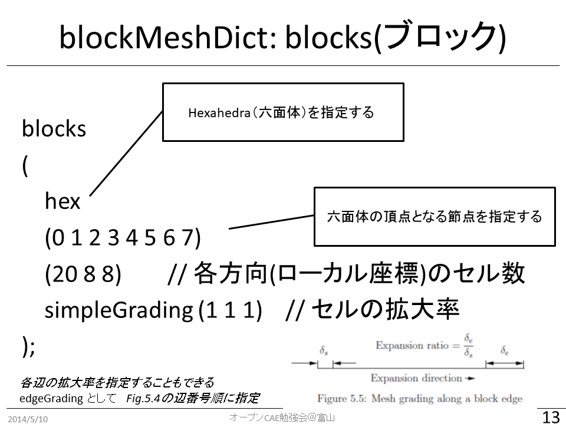
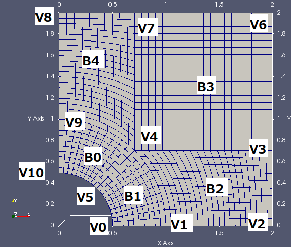

# OpenFOAMによるOpenFOAMのためのメッシュ生成（はじめの一歩）
## October 14, 2023; OpenCAE勉強会＠富山
### 中川慎二（富山県立大学）[Shinji NAKAGAWA，Toyama Prefectural University]  


## まえがき

Disclaimer: OPENFOAM is a registered trade mark of OpenCFD Limited, the producer of the OpenFOAM software and owner of the OPENFOAM and OpenCFD trade marks. This offering is not approved or endorsed by OpenCFD Limited.

OpenFOAMユーザーガイド，プログラマーズガイド，OpenFOAM Wiki，CFD Online，その他多くの情報を参考にしています。開発者，情報発信者の皆様に深い謝意を表します。

この講習内容は，講師の個人的な経験（主に，卒研生等とのコードリーディング）から得た知識を共有するものです。この内容の正確性を保証することはできません。この情報を使用したことによって問題が生じた場合，その責任は負いかねますので，予めご了承ください。

[TOC]


## 本文書での表記方法について

#### 端末から入力するコマンド

端末（ターミナル）で実行するコマンドは，次のように表記する。

> cp a b

#### ファイルやソースコードの内容

ファイル・ソースコード記載事項は次のように表記する。インデント（字下げ）は，必ずしもここに記載通りとは限らない。記入するファイルに合わせて，適切にインデントしてください。

```
solve
(
    fvm::ddt(T)
  - fvm::laplacian(DT, T)
);
```


## 準備


### Linuxコマンドの確認

端末内での実行場所移動：cd （チェンジ ディレクトリ）

> cd _移動先_

ディレクトリの作成：mkdir （メーク ディレクトリ）

> mkdir _ディレクトリ名_

　オプション　-p   親ディレクトリも同時に作成

ファイルやディレクトリのコピー：cp （コピー）

> cp _元ファイル_ _コピー先_

オプション　-p   元のファイル属性を保持（preserve）
オプション　-r   ディレクトリの中身もコピー ← 再帰的にコピー（recursive）

ファイルやディレクトリの移動：mv （ムーブ）

> mv _移動元_ _移動先_

　このコマンドは，名前の変更にも使う。


### 環境変数の確認

環境変数の確認方法など。各自の環境変数を調べ，別紙に記入してください。

システムのソースコード格納場所：$FOAM_SRC
> echo $FOAM_SRC

システムの例題格納場所：$FOAM_TUTORIALS
> echo $FOAM_TUTORIALS

システムの設定ファイル・ひな形など格納場所：$FOAM_ETC
> echo $FOAM_ETC

ユーザーのOpenFOAM作業場所：$FOAM_RUN
> echo $FOAM_RUN

### OpenFOAM用エイリアスの確認

よく使う場所（ディレクトリ）に移動するための簡単なエイリアス（別名コマンド）がOpenFOAMに用意されている。

- システムの例題格納場所への移動：`tut`
- システムのソースコード格納場所への移動：`src`
- ユーザーのOpenFOAMディレクトリへの移動：`ufoam`

これらの設定は`etc/config.sh/aliases`ファイルに記述されている。
https://develop.openfoam.com/Development/openfoam/-/blob/master/etc/config.sh/aliases

## 講習の流れ

OpenFOAM に付属する標準例題をベースとして，最も基本的なメッシュ生成ユーティリティblockMeshの使い方の基礎を学びます。例題を実行，設定ファイルを確認，改造して実行などの実習を行ないます。

### 関連情報

[blockMeshを使った標準例題のメモ](https://zenn.dev/snak/articles/7c96f101afbe70)

[Mesh Gallery created with blockMesh (OpenFOAM)](https://zenn.dev/snak/articles/e6ffa9c7e2fbf2)


## 環境

OpenFOAM 2106

このテキストは，オープンCAE勉強会＠富山で作成した仮想マシンを使うことを前提として作成しました。その環境でのOpenFOAMのバージョンはv2106です。

これ以外のバージョンの場合には，設定ファイルの内容が異なる可能性があります。使用しているOpenFOAM付属の例題を見て，読み替えてください。


## OpenFOAMでのメッシュ生成方法

OpenFOAM には，メッシュを生成・操作するための多くのユーティリティが付属している。（[User Guide Chapter 4](https://www.openfoam.com/documentation/user-guide/4-mesh-generation-and-conversion) ）

比較的単純なメッシュは，blockMeshユーティリティを使用して作成できる。最近は，PDRblockMeshというユーティリティも存在する。

少し複雑なメッシュは，任意形状のSTLファイルに適合したメッシュが生成可能なsnappyHexMesh ユーティリティを使用して生成できる。さらにfoamyHexMeshユーティリティも使用できる。snappyHexMeshの方が歴史が古く，使用例は多い。

OpenFOAMtとは開発者が異なるが，OpenFOAMのために開発されているメッシュ生成ソースソフトウェア[cfMesh](https://cfmesh.com/cfmesh-open-source/)も存在する。

その他にも，多くのオープンソースソフトウェアや，商用ソフトウェアでメッシュを生成することが可能である。

今回の講習では，blockMeshについて学ぶ。


## メッシュ関連例題の確認

例題ディレクトリで，メッシュ作成関連例題を確認する。メッシュ作成に特化した例題は，tutorials/meshにまとめられている。

```
user@user-VirtualBox:/opt/openfoam4/tutorials/mesh$ pwd
/opt/openfoam4/tutorials/mesh
user@user-VirtualBox:/opt/openfoam4/tutorials/mesh$ tree -L 2
.
├── PDRblockMesh
│   └── box0
├── blockMesh
│   ├── pipe
│   ├── sphere
│   ├── sphere7
│   ├── sphere7ProjectedEdges
│   ├── spheroid7Projected
│   └── spheroidProjected
├── extrudeMesh
│   └── polyline
├── foamyHexMesh
│   ├── Allclean
│   ├── Allrun
│   ├── blob
│   ├── flange
│   ├── mixerVessel
│   ├── simpleShapes
│   └── straightDuctImplicit -> ../../incompressible/porousSimpleFoam/straightDuctImplicit
├── foamyQuadMesh
│   ├── OpenCFD
│   ├── jaggedBoundary
│   └── square
├── moveDynamicMesh
│   ├── SnakeRiverCanyon
│   ├── relativeMotion
│   └── twistingColumn
├── parallel
│   ├── cavity
│   └── filter
├── refineMesh
│   └── refineFieldDirs
├── snappyHexMesh
│   ├── Allclean
│   ├── Allrun
│   ├── addLayersToFaceZone
│   ├── aerofoilNACA0012_directionalRefinement
│   ├── airfoilWithLayers
│   ├── distributedTriSurfaceMesh
│   ├── faceZoneRegions
│   ├── flange
│   ├── gap_detection
│   ├── iglooWithFridges -> ../../heatTransfer/buoyantBoussinesqSimpleFoam/iglooWithFridges
│   ├── iglooWithFridgesDirectionalRefinement
│   ├── motorBike -> ../../incompressible/simpleFoam/motorBike
│   ├── motorBike_leakDetection
│   ├── opposite_walls
│   └── snappyMultiRegionHeater -> ../../heatTransfer/chtMultiRegionFoam/snappyMultiRegionHeater
└── stitchMesh
    └── simple-cube1

46 directories, 4 files
```

これ以外にも，様々なソルバ用例題において，メッシュが作成されている。  


## blockMesh - icoFoam/cavity例題集を使って

blockMesh は，もっとも基本的なメッシュ生成ユーティリティである。

設定ファイルを細かく記述すれば，思い通りにコントロールしてメッシュを生成することも可能である。しかし，かなり煩雑は作業となるため，事前に入念な準備・設計が必要である。

次の章で使用するsnappyHexMeshユーティリティでも，まずはじめにblockMeshを実行する必要がある。

この章では，OpenFOAM付属の標準例題であるicoFoam/cavity例題を用いて，blockMeshの基本的な使い方を学ぶ。

### icoFoam/cavity例題集

$FOAM_TUTORIALS/incompressible/icoFoam/cavityに含まれるファイルの情報は次の通りである。（treeコマンドの実行）

> cd $FOAM_TUTORIALS/incompressible/icoFoam/cavity

```shell
 tree -L 1
.
├── Allclean
├── Allrun
├── cavity
├── cavityClipped
└── cavityGrade

3 directories, 2 files
```

icoFoam/cavityディレクトリ内には，3つ（cavity cavityGrade cavityClipped）の例題が含まれている。Allrunスクリプトを実行した場合には，cavityケースを複製（clone）した後に改造する2つ（cavityFine cavityHighRe）の例題も生成される。よって，合計5つの例題が含まれている。

$FOAM_TUTORIALS/incompressible/icoFoam/cavity/cavityに含まれるファイルの情報は次の通りである。（treeコマンドの実行）

> cd $FOAM_TUTORIALS/incompressible/icoFoam/cavity/cavity
>
> tree

```:shell
.
├── 0
│   ├── U
│   └── p
├── constant
│   └── transportProperties
└── system
    ├── PDRblockMeshDict
    ├── blockMeshDict
    ├── controlDict
    ├── decomposeParDict
    ├── fvSchemes
    └── fvSolution

3 directories, 9 files
```

### cavity例題集の作業ディレクトリへのコピー

ユーザーの作業ディレクトリ（＄FOAM_RUN）に，cavity例題集をコピーする。

GUIで操作する場合には，ファイルマネージャーを起動し，`$FOAM_TUTORIALS/incompressible/icoFoam/cavity/cavity`ディレクトリをコピーし，`$FOAM_RUN`へペーストする。

コマンドラインで操作する場合には，下記を実行する。

> cd $FOAM_RUN
>
> cp -r $FOAM_TUTORIALS/incompressible/icoFoam/cavity/cavity .

### cavity/cavity 例題のblockMeshDict の確認

ファイルマネージャーで，`$FOAM_RUN/cavity/system`まで移動し，blockMeshDictをダブルクリックして開く。

```
scale 0.1;

vertices
(
    (0 0 0)  //節点0
    (1 0 0)
    (1 1 0)
    (0 1 0)
    (0 0 0.1)
    (1 0 0.1)
    (1 1 0.1)
    (0 1 0.1) //節点7
);

blocks
(
    hex (0 1 2 3 4 5 6 7) (20 20 1) simpleGrading (1 1 1)  //block0
);

edges
(
);

boundary
(
    movingWall
    {
        type wall;
        faces
        (
            (3 7 6 2)
        );
    }
    fixedWalls
    {
        type wall;
        faces
        (
            (0 4 7 3)
            (2 6 5 1)
            (1 5 4 0)
        );
    }
    frontAndBack
    {
        type empty;
        faces
        (
            (0 3 2 1)
            (4 5 6 7)
        );
    }
);
```

#### blockMesh用設定ファイル blockMeshDict

blockMeshDictディクショナリの基本構造は次の通りである。

- scale（旧バージョンやFoundation版ではconvertToMeters）　単位変換の係数
    - 基本単位はm
    - たとえば，mm単位で記入するとき，この係数を0.001とする

- vertices　節点　　座標を与える
- blocks　ブロック
- edges　辺（円弧やスプラインの種類と通過点を指定する）
- boundary　面に関する情報（境界条件）

他にも，次の様な指定をすることができる。（[使用例](https://develop.openfoam.com/Development/openfoam/-/blob/master/tutorials/mesh/blockMesh/pipe/system/blockMeshDict)）詳細は[ソースコードヘッダ](https://develop.openfoam.com/Development/openfoam/-/blob/master/src/mesh/blockMesh/blockMesh/blockMesh.H)を参照してください。

- prescale
- transform
- geometry
- defaultPatch

blockMeshDictディクショナリの作成時には，次のことに気をつけると良い。

- 設計図をしっかりと描く！

- ブロック作成時に，点の順番を意識する！
    1. x座標（ローカル座標１）が増える，
    2. y座標（ローカル座標２）が増える，
    3. z座標（ローカル座標３）が増える。

- Dict を見やすく書く。
    - 正確なインデント，
    - 適切なコメント，など。

- 括弧 () の前には，空白を入れる．

blockMeshDictの書き方に，いくつかの方法が挙げられる。
- 数字を直接書き込む （変数も使用可）
    - 基本
    - 形状変更時に手間がかかる
- Dictionary に コード（プログラム）を書いて，汎用化
    - #eval{  }; [ソース](https://develop.openfoam.com/Development/openfoam/-/blob/master/src/OpenFOAM/db/dictionary/functionEntries/evalEntry/evalEntry.H)
    - #calc, codeStream
- マクロ言語プロセッサ m4 を利用して，汎用化
    - blockMeshDict を生成するためのファイルを作成
    - 形状変更等が容易になる

- プログラム・スクリプトを作成して生成する

##### blockMeshDict: vertices (節点)

３次元座標で点の位置を指定する。始めに指定した点が0番となり，順に増える番号が内部で付与される。後の設定では，この節点番号で点を指示する。

|  |
| :--------------------------------------: |
|        図 　blockMeshDict: vertices        |

自動で付けられる番号だけでなく，指定した名前を付けることも可能である。[UserGuide 5.4.9 Naming vertices, edges, faces and blocks (cfd-direct)](https://doc.cfd.direct/openfoam/user-guide-v11/blockmesh#x28-1590005.4.9)

```c++
vertices
(
    name v0 (0 0 0)  // 0番，あるいは v0 という名前
    name v1 (1 0 0)
);
```

##### blockMeshDict: blocks(ブロック)

六面体としてブロックを定義する。hexのあとに，６面体の頂点となる節点の番号（あるいは名前）を列記する。前述の通り，点の指定順によって，ブロック内でのローカルな座標系が決定される。

各方向（ローカル座標）のセル数と拡大率を指定する。拡大率は，座標が最大であるセルの大きさ／座標が最小であるセルの大きさとして定義される。

|  |
| :--------------------------------------: |
|  |
|         図 　blockMeshDict: blocks         |

ブロックにも定義した順番に自動的に番号が付与される。それに加えて名前を付けることもできる。
```c++
blocks
(
    hex (v0 v1 v2 v3 v4 v5 v6 v7) (8 8 8) simpleGrading (1 1 1)  // 0番のブロック

    // 1番のブロック．名前は sideBlock．
    name sideBlock hex (v0 v3 v9 v8 v4 v7 v11 v10) (8 20 8) simpleGrading (1 1 1)
);
```

グレーディングの方法には次の様な種類がある。
- simpleGrading　（3方向での指定）
- edgeGrading　（12個の辺に個別の拡大率を指定可能）

##### blockMeshDict: edges (線)

2つの節点間を結ぶ線の種類を指定できる。指定をしなければ、直線で結ばれる。下記の種類が選択可能である。

| 指定するキーワード | 説明               | 追加で指定する情報 |
| ---------          | ------------------ | --------- |
| arc                | 円弧               | 途中の1点     |
| simpleSpline       | スプライン曲線     | 途中の点のリスト  |
| polyLine           | 多角線             | 途中の点のリスト  |
| polySpline         | スプライン曲線の組 | 途中の点のリスト  |
| line               | 直線               | ー     |

##### blockMeshDict: boundary (境界面)

境界面には，任意の名前を付ける。ただし，他のファイルの情報（boudary, U, p など）と一致させる必要がある。条件指定時に正規表現が使えるため，同じ条件を付与する面には部分一致する名前を付けるなどの工夫をすると良い。

typeキーワードに続けて，境界条件に応じた型を与える。

面（faces）は，4つの節点（または，[ブロック番号と面番号](https://develop.openfoam.com/Development/openfoam/-/blob/master/tutorials/mesh/blockMesh/pipe/system/blockMeshDict#L165)）で指定する。１つの名前に，複数の面をまとめて指定できる。


#### blockMesh の実行

cavity ディレクトリから端末を起動し，blockMeshを実行する。

ファイルマネージャーで，cavityまで移動する。ファイルマネージャー上で右クリックして，「Open Terminal Here」をクリックして端末を起動する。

メッシュ生成ユーティリティblockMeshを実行する。
> blockMesh

端末に実行結果が表示される。エラーメッセージが表示されていないか，確認する。

#### paraFoam の実行とメッシュの確認

可視化ソフトを起動するため，paraFoamを実行する。
> paraFoam

ParaViewが起動したら，緑色になっているApplyボタンをクリックする。「Surface with Edges」形式で表示することで，作成されたメッシュが確認できる。

|  |
| :--------------------------------------: |
|       図 　mesh from cavity tutorial       |

メッシュが正しく作成されているか確認するために，Axes Gridを表示することを推奨する。初心者に多いミスとして，形状は正しいが，大きさが異なるというものがある。

#### blockMeshDict 内での変数利用方法の説明

blockMeshDict を操作するさい，数字を直接書く代わりに，変数を使用することができる。

変数に値をセットする方法：設定ファイル内では，次のように，変数名と数字を並べて書き，間には空白を入れる。数字の後ろにはセミコロンを入れる。

```
xMax 0;
```

*変数を使う時*には，変数名の前に$を追加する。

```
$xMax
```

この記述方法を使って，もとのblockMeshDictを次のように書き換える。

```blockMeshDict改造例
scale 0.1;

xMin 0;
xMax 1;
yMin 0;
yMax 1;
zMin 0;
zMax 0.1;

nx 20; ny 20; nz 1;

vertices
(
    ($xMin $yMin $zMin)
    ($xMax $yMin $zMin)
    ($xMax $yMax $zMin)
    ($xMin $yMax $zMin)
    ($xMin $yMin $zMax)
    ($xMax $yMin $zMax)
    ($xMax $yMax $zMax)
    ($xMin $yMax $zMax)
);

blocks
(
    hex (0 1 2 3 4 5 6 7) ($nx $ny $nz) simpleGrading (1 1 1)
);

以下は変更なし
```

先ほどと同様に，blockMesh を実行し，paraFoam でメッシュを確認する。実行時にエラーメッセージが表示されていないかも確認する。

正方形領域を作成したい場合には，変数の使い方を下記の様に変更することも検討するとよい。下記の例は，yMinとyMaxとの値を，それぞれxMinとxMaxと同じにするものである。

```
xMin 0;     xMax 1;
yMin $xMin; yMax $xMax;
```

##### z方向のサイズを他と同じ大きさ，分割数に変更してメッシュを生成する。

変数を使用すると，メッシュの変更が容易になる。例えば，z方向の大きさを変更して，計算領域を立方体とするには，次のように，zMaxとNzを書き換える。

```blockMeshDict改造例
scale 0.1;

xMin 0;
xMax 1;
yMin 0;
yMax 1;
zMin 0;
zMax 1;
Nx 20; Ny 20; Nz 20;

以下は変更なし
```

2箇所を書き換えるだけで，下記のメッシュが生成できる。

|  |
| :--------------------------------------: |
| 図 　z-extended mesh from cavity tutorial  |

##### 自習

計算領域の大きさ，分割数などを変更して，いろいろなメッシュを生成し，確認してみる。

#### 簡単な計算式を使ってみる

例えば，x，y，zの最小値はすべて0とし，$yMax=xMax$，$zMax=xMax/10$ という計算領域を作成したいとする。次のように記述することができる。

```shell
xMin 0; yMin $xMin; zMin $xMin;
yMax $xMax;
zMax #eval { $xMax / 10 };
```

evalでは，様々な数式や関数が使用できる。`sin(pi()*$a/$b)`など。

#### Grading（引き寄せ）の設定（各自で挑戦）

ここまでは，等間隔メッシュを作成した。シミュレーションでは，物理量の変化が激しい場所には，細かなメッシュを使用することが望ましい。そのために，生じる物理現象を予想し，物理量の変化の激しい部分に細かなメッシュを作成する。

［やってみよう］simpleGrading の設定を変更してみる。例えば，y方向を0.5にする。

［やってみよう］simpleGrading に変わって，edgeGrading (1 1 1 1 0.5 0.5 0.5 0.5 1 1 1 1)とする。先と同じ。

［やってみよう］simpleGrading に変わって，edgeGrading (1 1 1 1 1 0.4 0.4 1 1 1 1 1)とする。lid側だけが寄せられる。

［やってみよう］さらには，Multi-gradingを試す。

```
    simpleGrading
    (
        1 // x-direction expansion ratio
        (
            (0.2 0.3 4) // 20% y-dir, 30% cells, expansion = 4
            (0.6 0.4 1) // 60% y-dir, 40% cells, expansion = 1
            (0.2 0.3 0.25) // 20% y-dir, 30% cells, expansion = 0.25 (1/4)
        )
        3 // z-direction expansion ratio
    )
```

### cavity/cavityClipped 例題

cavity例題の計算領域の一部を除外したような形状について考える。シンプルではあるが，blockMeshで作成する時には，手間が増える。ここでは，face matching型の3つのブロックを使って計算領域とメッシュを作成する

次の作業を実施する。

1. cavity/cavityClipped ディレクトリへ移動

1. blockMeshDict の確認

    1. 特徴：マルチブロック（face matching型）

1. blockMesh の実行

1. paraFoam の実行とメッシュの確認

|  |
| :--------------------------------------: |
|   図 　mesh from cavityClipped tutorial    |

```
convertToMeters 0.1;

xMin 0; xMid 0.6; xMax 1;
yMin 0; yMid 0.4; yMax 1;
zMin 0;zMax 0.1;
Nx1 12; Nx2 8;
Ny1 12; Ny2 8;
Nz 1;

vertices
(
    ($xMin $yMin $zMin)
    ($xMid $yMin $zMin)
    ($xMin $yMid $zMin)
    ($xMid $yMid $zMin)
    ($xMax $yMid $zMin)
    ($xMin $yMax $zMin)
    ($xMid $yMax $zMin)
    ($xMax $yMax $zMin)

    ($xMin $yMin $zMax)
    ($xMid $yMin $zMax)
    ($xMin $yMid $zMax)
    ($xMid $yMid $zMax)
    ($xMax $yMid $zMax)
    ($xMin $yMax $zMax)
    ($xMid $yMax $zMax)
    ($xMax $yMax $zMax)

);

blocks
(
    hex (0 1 3 2 8 9 11 10) ($Nx1 $Ny2 $Nz) simpleGrading (1 1 1)
    hex (2 3 6 5 10 11 14 13) ($Nx1 $Ny1 $Nz) simpleGrading (1 1 1) // (1 0.5 1)
    hex (3 4 7 6 11 12 15 14) ($Nx2 $Ny1 $Nz) simpleGrading (1 1 1) // (1 0.5 1)
);

edges
(
);

boundary
(
    lid
    {
        type wall;
        faces
        (
            (5 13 14 6)
            (6 14 15 7)
        );
    }
    fixedWalls
    {
        type wall;
        faces
        (
            (0 8 10 2)
            (2 10 13 5)
            (7 15 12 4)
            (4 12 11 3)
            (3 11 9 1)
            (1 9 8 0)
        );
    }
    frontAndBack
    {
        type empty;
        faces
        (
            (0 2 3 1)
            (2 5 6 3)
            (3 6 7 4)
            (8 9 11 10)
            (10 11 14 13)
            (11 12 15 14)
        );
    }
);

mergePatchPairs
(
);
```

#### ブロック構造の確認方法

複数のブロックから計算領域・メッシュが構成されるとき，全体像を把握するのが困難になってくる。理解を容易にするために，トポロジーを書き出して表示することができる。

トポロジー情報の書き出しには，次を実行する。この`-write-vtk`オプションを付けた時には，メッシュは生成されず，`blockTopology.vtu`というファイルが作成される。

> blockMesh -write-vtk

paraFoamを実行する。メッシュを表示する。さらに，FileメニューからOpenを選択し，先ほど作成された`blockTopology.vtu`を開く。

blockMeshDictでscaleを1以外にしていると，両者の大きさが異なる。その場合には，ParaView上で`blockTopology.vtu`をハイライトし，Transforming欄のScaleをblockMeshDictで指定した値に変更する。`blockTopology.vtu`をWireframe表示として，表示色を赤色・Lineを太くに変更すると，下記の様な表示となる。

|  |
| :--------------------------------------: |
| 図 　mesh and topology (red) from cavityClipped tutorial  |

### cavityClipped 例題の改造（mergePatchの使用）

標準状態のcavityClipped例題では，メッシュの境目でメッシュが一致するように作成した。メッシュが一致しない状態でもmergePatchを指定することで，メッシュの生成ができる。

1. cavity/cavityClipped ディレクトリへ移動
1. blockMeshDict の変更
    1. mergePatchPairsの指定　特徴：マルチブロック（face merging型）
1. blockMesh の実行
1. paraFoam の実行とメッシュの確認

```c++: blockMeshDict例
convertToMeters 0.1;

xMin 0; xMid 0.6; xMax 1;
yMin 0; yMid 0.4; yMax 1;
zMin 0;zMax 0.1;
Nx1 12; Nx2 8;
Ny1 12; Ny2 8;
Nz 1;

vertices
(
    ($xMin $yMin $zMin)  //0
    ($xMid $yMin $zMin)
    ($xMin $yMid $zMin)  //2
    ($xMid $yMid $zMin)

    ($xMax $yMid $zMin)  //4
    ($xMin $yMax $zMin)
    ($xMid $yMax $zMin)  //6
    ($xMax $yMax $zMin)

    ($xMin $yMin $zMax)  //8
    ($xMid $yMin $zMax)
    ($xMin $yMid $zMax)  //10
    ($xMid $yMid $zMax)

    ($xMax $yMid $zMax)  //12
    ($xMin $yMax $zMax)
    ($xMid $yMax $zMax)  //14
    ($xMax $yMax $zMax)

    // for merged
    ($xMin $yMid $zMin)  //2=16
    ($xMax $yMid $zMin)  //4=17
    ($xMin $yMid $zMax)  //10=18
    ($xMax $yMid $zMax)  //12=19
);

blocks
(
    //block 0: bottom block
    hex (0 1 3 2 8 9 11 10) ($Nx1 $Ny2 $Nz) simpleGrading (1 1 1)
    //block 1: top block
    hex (16 17 7 5 18 19 15 13) ($Nx1 $Ny1 $Nz) simpleGrading (1 1 1)
);

edges
(
);

boundary
(
    inner-bottom //top of bottom block, inner-face
    {
        type patch;
        faces
        (
            (3 2 10 11)
        );
    } 
    fixedWalls-mid //bottom of top block, inner-face and wall
    {
        type wall;
        faces
        (
            (17 16 18 19)
        );
    }
    lid
    {
        type wall;
        faces
        (
            (5 7 15 13)
        );
    }
    fixedWalls
    {
        type wall;
        faces
        (
            (0 8 10 2) //bottom left
            (3 11 9 1)  // bottom right
            (1 9 8 0)  // bottom bottom
            (16 5 13 18) // top left
            (17 7 15 19) // top right
        );
    }
    frontAndBack
    {
        type empty;
        faces
        (
            (0 2 3 1)
            (8 9 11 10)
            (16 17 7 5)
            ( 18 19 15 13)
        );
    }
);

mergePatchPairs
(
    ( inner-bottom fixedWalls-mid )
);
```

計算実行時には，controlDict の開始時刻，終了時刻を修正し，pとUファイルの固定壁面のパッチ名を `"fixedWalls.*" //fixedWalls` と変更する。正規表現を使って，fixedWallsとfixedWalls-midという2つのパッチに同じ条件を与えるため。

### 少し複雑なメッシュの例

円に沿った形状
/opt/openfoam4/tutorials/stressAnalysis/solidDisplacementFoam/plateHole/

5つのブロックで構成する。edge指定によって，円弧を作成する。

|  |
| :--------------------------------------: |
|     図 　mesh from plateHole tutorial      |

斜め（ｘ，ｙ，ｚ軸と直交しない）メッシュの場合，指定する分割数はどのように解釈されるだろうか？

全体座標系（ｘ，ｙ，ｚ軸）と局所座標系（そのブロックに対するｘ1，ｘ2，ｘ3軸）との関係について，理解が必要である。ブロックを構成する時に指定する節点の順番によって，これらの関係が定められる。

詳細は [User Guide section 4.3](https://www.openfoam.com/documentation/user-guide/4-mesh-generation-and-conversion/4.3-mesh-generation-with-the-blockmesh-utility#x13-420004.3.1) を参照する。

## Projectionについて

[ユーザーガイドの説明 https://doc.cfd.direct/openfoam/user-guide-v11/blockmesh#x28-1580005.4.8](https://doc.cfd.direct/openfoam/user-guide-v11/blockmesh#x28-1580005.4.8)

[使用例　https://develop.openfoam.com/Development/openfoam/-/tree/master/tutorials/mesh/blockMesh/pipe](https://develop.openfoam.com/Development/openfoam/-/tree/master/tutorials/mesh/blockMesh/pipe)

|  |
| :--------------------------------------: |
| 図 　block topology and mesh from pipe tutorial  |

## 参考

User Guide: 4.3 Mesh generation with the blockMesh utility
    https://www.openfoam.com/documentation/user-guide/4-mesh-generation-and-conversion/4.3-mesh-generation-with-the-blockmesh-utility
    

OpenFOAM v11 User Guide - 5.4 Mesh generation with the blockMesh utility
    https://doc.cfd.direct/openfoam/user-guide-v11/blockmesh


# Release note から

## v2306
https://www.openfoam.com/news/main-news/openfoam-v2306/pre-processing

    snappyHexMesh: avoiding excess balancing more...
    Improved checkMesh more...


## v2212

https://www.openfoam.com/news/main-news/openfoam-v2212/pre-processing

    Improved checkMesh more...
    Improved changeDictionary utility more...
    New snappyHexMesh curvature-based refinement more...
    Improved setFields more...
    New clipPlane topo-set more...


## v2206
https://www.openfoam.com/news/main-news/openfoam-v2206/pre-processing

    New snappyHexMesh automatic leak closure more...
    Improved snappyHexMesh optimisation more...
    Improved snappyHexMesh layer addition more...
    New holeToFace topoSet source more...
    Improved createPatch utility more...
    Improved triSurfaceMesh: detect inconsistent orientation more...
    New setTurbulenceFields pre-processing utility more...


## v2112
https://www.openfoam.com/news/main-news/openfoam-v2112/pre-processing

    New Function1 entries more...
    Improved expressions more...
    Improved blockMesh utility more...
    snappyHexMesh parallel consistency improvements more...
    New zone handling for splitMeshRegions more...


## v2106

https://www.openfoam.com/news/main-news/openfoam-v2106/pre-processing

    Improved snappyHexMesh gap refinement more...
    Improved splitMeshRegions utility more...
    Community contribution New spline support for extrudeMesh more...
    Improved checkMesh writing of surface fields more...
    Improved utility region handling more...
    Improved patch expressions more...


## v2012

### blockMesh: improvements

https://www.openfoam.com/news/main-news/openfoam-v20-12/pre-processing#pre-processing-blockmesh

### Improved PDRblockMesh

https://www.openfoam.com/news/main-news/openfoam-v20-12/pre-processing#pre-processing-pdrblockmesh


    snappyHexMesh: new hybrid layer input more...
    snappyHexMesh: improved gap refinement controls more...
    snappyHexMesh: delete small regions more...
    snappyHexMesh: consistent layer extrusion more...
    Community contribution extrudeMesh: new polyLine option more...
    blockMesh: improvements more...
    Improved PDRblockMesh more...
    Miscellaneous improvements more...

## v2006

### OpenFOAM® v2006: New and improved pre-processing

https://www.openfoam.com/news/main-news/openfoam-v20-06/pre-processing#pre-processing-blockmesh


    Improved blockMesh utility more...
    New baffle creation in blockMesh more...
    New ramp Function1 more...
    New expression Function1 more...
    New expression PatchFunction1 more...
    New coded PatchFunction1 more...
    snappyHexMesh: New controls to disable gap refinement more...

## v1912

### Inline expressions in dictionaries

https://www.openfoam.com/news/main-news/openfoam-v1912/pre-processing#pre-processing-inline-expressions

### snappyHexMesh : automatic closure of thin gaps

https://www.openfoam.com/news/main-news/openfoam-v1912/pre-processing#pre-processing-snappy-gap-closure

    New expressions-based setFields more...
    New set fields utility for PDRFoam more...
    Wall distance output from checkMesh more...
    snappyHexMesh: automatic gap closure more...

## v1906

### snappyHexMesh : dry-run operation

https://www.openfoam.com/node/260#pre-processing-snappy-dry-run

### snappyHexMesh: Improved memory optimisation

https://www.openfoam.com/node/260#pre-processing-snappy-memory-optimisation

### snappyHexMesh: new relaxed patch regioning

https://www.openfoam.com/node/260#pre-processing-snappy-relaxed-patch-regioning

## v1812

### New snappyHexMesh directional stretching
https://www.openfoam.com/node/271#pre-processing-snappy-directional-stretching

### New leakage detection
https://www.openfoam.com/node/271#pre-processing-leakage-detection

### Improvements for topo-sets and searchable surfaces
https://www.openfoam.com/node/271#pre-processing-topo-selections

### Improved input dictionary robustness
https://www.openfoam.com/node/271#pre-processing-dictionary-robustness

## v1806
https://www.openfoam.com/news/main-news/openfoam-v1806

    New dry-run solver set-up checks more...
    Improved input dictionary robustness more...
    New string expansion shortcuts more...
    Improved field mapping in parallel more...
    snappyHexMesh: New directional refinement more...

## v1712
https://www.openfoam.com/news/main-news/openfoam-v1712

    Integration of cfmesh more...
    Improved checkMesh utility output more...
    Improved dictionary operation more...
    Improved stitchMesh utility

## v1706
https://www.openfoam.com/news/main-news/openfoam-v1706

## v1612+
https://www.openfoam.com/news/main-news/openfoam-v1612

    Updated renumber mesh more...
    Updated surface checking more...
    snappyHexMesh: Updated locations in mesh more...
    snappyHexMesh: New region handling more...

## v1606+
https://www.openfoam.com/news/main-news/openfoam-v1606

    New snappyHexMesh (un)refinement functionality more...
    Improved behaviour of locations in mesh more...
    Improved support for layer generation on complex face zones more...
    Improved automatic gap refinement to pick up additional features more...

## v3.0+
https://www.openfoam.com/news/main-news/openfoam-v3.0

    snappyHexMesh now both detects and allows users to specify the minimum number of cells across close-proximity features more... 
    snapphHexMesh now allows the user to limit the number of refinement levels per geometric region more...
    snappyHexMesh now allows the optional insertion of layers to the two separate patches of a baffle face zone more...
    snappyHexMesh now supports additional methods to supply the location(s) in mesh more...
    snappyHexMesh has been extended to include per-region-based refinement more...
    snappyHexMesh analytical shapes have been extended to include new cone and box geometric entities more...
    snappyHexMesh now identifies surface intersections as feature lines and offers improved local refinement more...
    snappyHexMesh now optionally smooths the volume mesh to improve orthogonality between cell refinement levels more...
    snappyHexMesh now optionally splits boundary faces for improved conformance to surface features more...
    snappyHexMesh layer mesh motion methods can now be selected at run time more...
    subsetMesh now include the option to specify the patch in which to receive newly uncovered faces more...
    checkMesh exports bad quality cells more...


## 備考


### ブロックメッシュの例題候補

候補1：/opt/openfoam4/tutorials/incompressible/pimpleFoam/TJunction
・4ブロック
・simpleGrading (1 1 1) のみ

候補2：/opt/openfoam4/tutorials/incompressible/pimpleFoam/pitzDaily
・13ブロック
・simpleGrading だが，比の組合わせは多数
・複雑すぎる？

候補3：/opt/openfoam4/tutorials/incompressible/simpleFoam/pipeCyclic/
・edgesのarcを使用
・1ブロック
・cyclicAMI　transform rotational;　を使用
・#calcと変数を使用
・軸対称，特殊すぎる？
