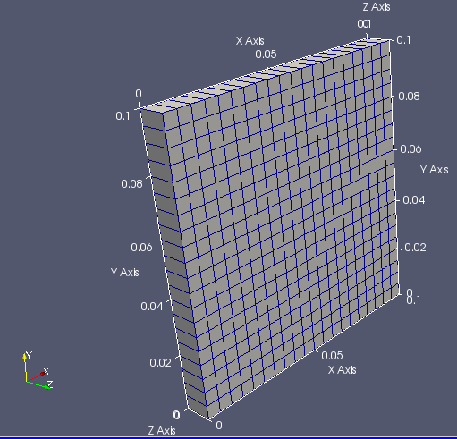
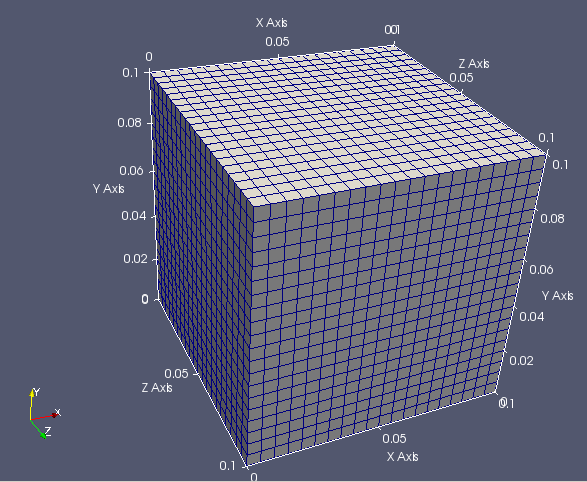
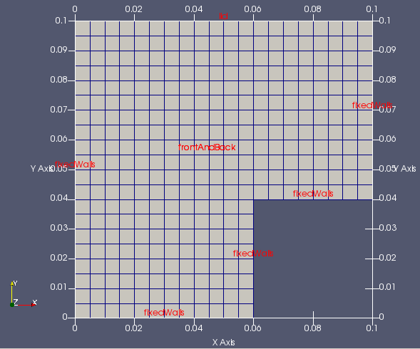

# OpenFOAMによるOpenFOAMのためのメッシュ生成（はじめの一歩）
## June 17, 2017; OpenCAE勉強会＠富山
### 中川慎二（富山県立大学）[SHINJI NAKAGAWA，Toyama Prefectural University]  


## まえがき

Disclaimer: OPENFOAM is a registered trade mark of OpenCFD Limited, the producer of the OpenFOAM software and owner of the OPENFOAM and OpenCFD trade marks. This offering is not approved or endorsed by OpenCFD Limited.

OpenFOAMユーザーガイド，プログラマーズガイド，OpenFOAM Wiki，CFD Online，その他多くの情報を参考にしています。開発者，情報発信者の皆様に深い謝意を表します。

この講習内容は，講師の個人的な経験（主に，卒研生等とのコードリーディング）から得た知識を共有するものです。この内容の正確性を保証することはできません。この情報を使用したことによって問題が生じた場合，その責任は負いかねますので，予めご了承ください。

[TOC]


## 本文書での表記方法について

#### 端末から入力するコマンド

端末（ターミナル）で実行するコマンドは，次のように表記する。

> cp a b

#### ファイルやソースコードの内容

ファイル・ソースコード記載事項は次のように表記する。インデント（字下げ）は，必ずしもここに記載通りとは限らない。記入するファイルに合わせて，適切にインデントしてください。

```
solve
(
    fvm::ddt(T)
  - fvm::laplacian(DT, T)
);
```


## 準備


### Linuxコマンドの確認

端末内での実行場所移動：cd （チェンジ ディレクトリ）

> cd _移動先_

ディレクトリの作成：mkdir （メーク ディレクトリ）

> mkdir _ディレクトリ名_

　オプション　-p   親ディレクトリも同時に作成

ファイルやディレクトリのコピー：cp （コピー）

> cp _元ファイル_ _コピー先_

オプション　-p   元のファイル属性を保持（preserve）
オプション　-r   ディレクトリの中身もコピー ← 再帰的にコピー（recursive）

ファイルやディレクトリの移動：mv （ムーブ）

> mv _移動元_ _移動先_

　このコマンドは，名前の変更にも使う。


### 環境変数の確認

環境変数の確認方法など。各自の環境変数を調べ，別紙に記入してください。

システムの例題格納場所：$FOAM_TUTORIALS
> echo $FOAM_TUTORIALS

ユーザーのOpenFOAM作業場所：$FOAM_RUN
> echo $FOAM_RUN


## 講習の流れ ##

OpenFOAM に付属する標準例題をベースとして，2つのメッシュ生成ユーティリティ（blockMesh と snappyHexMesh）の使い方の基礎を学びます。例題を実行，設定ファイルを確認，改造して実行などの実習を行ないます。

## 環境

OpenFOAM 4

このテキストは，オープンCAE勉強会＠富山で作成した仮想マシンを使うことを前提として作成しました。このマシンでは，端末起動時にはOpenFOAM実行環境は読み込まれません。複数のOpenFOAMバージョンを使い分けるためです。OpenFOAM 4 を使用するためには，端末起動後に，of4 というスクリプトを実行する必要があります。

OpenFOAM 4 が使用できる状態の端末では，of4 を実行する必要はありません。


## OpenFOAMでのメッシュ生成方法

OpenFOAM には，メッシュを生成・操作するための多くのユーティリティが付属している。（User Guide 3.6.2～3.6.5 U-96～99 ）

比較的単純なメッシュは，blockMeshユーティリティを使用して作成できる。

少し複雑なメッシュは，任意形状のSTLファイルに適合したメッシュが生成可能なsnappyHexMesh ユーティリティを使用して生成できる。さらにfoamyHexMeshユーティリティも使用できる。snappyHexMeshの方が歴史が古く，使用例は多い。

OpenFOAMに付属するものではないが，OpenFOAMのために開発されているメッシュ生成ソースソフトウェアcfMeshも存在する。

その他にも，多くのオープンソースソフトウェアや，商用ソフトウェアでメッシュを生成することが可能である。

今回の講習では，blockMesh および snappyHexMesh の使用方法について学ぶ。


## メッシュ関連例題の確認

例題ディレクトリで，メッシュ作成関連例題を確認する。メッシュ作成に特化した例題は，tutorials/meshにまとめられている。

```
user@user-VirtualBox:/opt/openfoam4/tutorials/mesh$ pwd
/opt/openfoam4/tutorials/mesh
user@user-VirtualBox:/opt/openfoam4/tutorials/mesh$ tree -L 2
.
├── foamyHexMesh
│   ├── Allrun
│   ├── blob
│   ├── flange
│   ├── mixerVessel
│   ├── simpleShapes
│   └── straightDuctImplicit -> ../../incompressible/porousSimpleFoam/straightDuctImplicit
├── foamyQuadMesh
│   ├── OpenCFD
│   ├── jaggedBoundary
│   └── square
├── moveDynamicMesh
│   └── SnakeRiverCanyon
├── refineMesh
│   └── refineFieldDirs
└── snappyHexMesh
    ├── Allrun
    ├── flange
    ├── iglooWithFridges -> ../../heatTransfer/buoyantBoussinesqSimpleFoam/iglooWithFridges
    ├── motorBike -> ../../incompressible/simpleFoam/motorBike
    └── snappyMultiRegionHeater -> ../../heatTransfer/chtMultiRegionFoam/snappyMultiRegionHeater
19 directories, 2 files
```

これ以外にも，様々なソルバ用例題において，メッシュが作成されている。  


## blockMesh - icoFoam/cavity例題集を使って

blockMesh は，もっとも基本的なメッシュ生成ユーティリティである。

設定ファイルを細かく記述すれば，思い通りにコントロールしてメッシュを生成することも可能である。しかし，かなり煩雑は作業となるため，事前に入念な準備・設計が必要である。

次の章で使用するsnappyHexMeshユーティリティでも，まずはじめにblockMeshを実行する必要がある。

この章では，OpenFOAM付属の標準例題であるicoFoam/cavity例題を用いて，blockMeshの基本的な使い方を学ぶ。

### icoFoam/cavity例題集

$FOAM_TUTORIALS/incompressible/icoFoam/cavity/に含まれるファイルの情報は次の通りである。（treeコマンドの実行）
> cd $FOAM_TUTORIALS/incompressible/icoFoam/cavity/
>
> tree

```
user@user-VirtualBox:~$ tree $FOAM_TUTORIALS/incompressible/icoFoam/cavity/
/opt/openfoam4/tutorials/incompressible/icoFoam/cavity/
├── Allclean
├── Allrun
├── cavity
│   ├── 0
│   │   ├── U
│   │   └── p
│   ├── constant
│   │   └── transportProperties
│   └── system
│       ├── blockMeshDict
│       ├── controlDict
│       ├── fvSchemes
│       └── fvSolution
├── cavityClipped
│   ├── 0
│   │   ├── U
│   │   └── p
│   ├── constant
│   │   └── transportProperties
│   └── system
│       ├── blockMeshDict
│       ├── controlDict
│       ├── fvSchemes
│       ├── fvSolution
│       └── mapFieldsDict
└── cavityGrade
    ├── 0
    │   ├── U
    │   └── p
    ├── constant
    │   └── transportProperties
    └── system
        ├── blockMeshDict
        ├── controlDict
        ├── fvSchemes
        ├── fvSolution
        └── mapFieldsDict

12 directories, 25 files
user@user-VirtualBox:~$ 
```

このcavityディレクトリ内には，3つ（cavity cavityGrade cavityClipped）の例題が含まれている。Allrunスクリプトを実行した場合には，cavityケースを複製（clone）した後に改造する2つ（cavityFine cavityHighRe）の例題も生成される。よって，合計5つの例題が含まれている。

### cavity例題集の作業ディレクトリへのコピー

ユーザーの作業ディレクトリ（＄FOAM_RUN）に，cavity例題集をコピーする。

GUIで操作する場合には，ファイルマネージャーを起動し，$FOAM_TUTORIALS（/opt/openfoam4/tutorials/incompressible/icoFoam/cavity）ディレクトリをコピーし，$FOAM_RUN（/home/user/OpenFOAM/user-4.1/run/）へペーストする。

コマンドラインで操作する場合には，下記を実行する。

> cd $FOAM_RUN
>
> cp -r $FOAM_TUTORIALS/incompressible/icoFoam/cavity/ .

### cavity/cavity 例題のblockMeshDict の確認

ファイルマネージャーで，/home/user/OpenFOAM/user-4.1/run/cavity/cavity まで移動し，blockMeshDictをダブルクリックして開く。

```
convertToMeters 0.1;

vertices
(
    (0 0 0)  //節点0
    (1 0 0)
    (1 1 0)
    (0 1 0)
    (0 0 0.1)
    (1 0 0.1)
    (1 1 0.1)
    (0 1 0.1) //節点7
);

blocks
(
    hex (0 1 2 3 4 5 6 7) (20 20 1) simpleGrading (1 1 1)  //block0
);

edges
(
);

boundary
(
    movingWall
    {
        type wall;
        faces
        (
            (3 7 6 2)
        );
    }
    fixedWalls
    {
        type wall;
        faces
        (
            (0 4 7 3)
            (2 6 5 1)
            (1 5 4 0)
        );
    }
    frontAndBack
    {
        type empty;
        faces
        (
            (0 3 2 1)
            (4 5 6 7)
        );
    }
);

mergePatchPairs
(
);
```

#### blockMesh用設定ファイル blockMeshDict

blockMeshDictディクショナリの基本構造は次の通りである。

- convertToMeters　単位変換の係数
    - 基本単位はm
    - たとえば，mm単位で記入するとき，この係数を0.001とする

- vertices　節点　　座標を与える
- blocks　ブロック
- edges　辺（円弧やスプラインの種類と通過点を指定する）
- patches　面に関する情報（境界条件）

blockMeshDictディクショナリの作成時には，次のことに気をつけると良い。

- 設計図をしっかりと描く！

- ブロック作成時に，点の順番を意識する！
    1. x座標（ローカル座標１）が増える，
    2. y座標（ローカル座標２）が増える，
    3. z座標（ローカル座標３）が増える。

- Dict を見やすく書く。
    - 正確なインデント，
    - 適切なコメント，など。

- 括弧 () の前には，空白を入れる．

blockMeshDictの書き方に，いくつかの方法が挙げられる。
-  数字を直接書き込む （変数も使用可）
    - 基本
    - 形状変更時に手間がかかる
-  マクロ言語プロセッサ m4 を利用して，汎用化
    - blockMeshDict を生成するためのファイルを作成
    - 形状変更等が容易になる
-  Dictionary に コード（プログラム）を書いて，汎用化
-  プログラム・スクリプトを作成して生成する

##### blockMeshDict: vertices (節点)

３次元座標で点の位置を指定する。始めに指定した点が０番となり，順に増える番号が内部で付与される。後の設定では，この節点番号で点を指示する。

|  |
| :--------------------------------------: |
|        図 　blockMeshDict: vertices        |

##### blockMeshDict: blocks(ブロック)

六面体としてブロックを定義する。hexのあとに，６面体の頂点となる節点の番号を列記する。前述の通り，点の指定順によって，ブロック内でのローカルな座標系が決定される。

各方向（ローカル座標）のセル数と拡大率を指定する。拡大率は，座標が最大であるセルの大きさ／座標が最小であるセルの大きさとして定義される。

|  |
| :--------------------------------------: |
|  |
|         図 　blockMeshDict: blocks         |

##### blockMeshDict: edges (線)

2つの節点間を結ぶ線の種類を指定できる。指定をしなければ、直線で結ばれる。下記の種類が選択可能である。

| 指定するキーワード | 説明      | 追加で指定する情報 |
| --------- | ------- | --------- |
| arc       | 円弧      | 途中の1点     |
| spline    | スプライン曲線 | 途中の点のリスト  |
| polyLine  | 多角線     | 途中の点のリスト  |

##### blockMeshDict: boundary (境界面)

境界面には，任意の名前を付ける。ただし，他のファイルの情報（boudary, U, p など）と一致させる必要がある。条件指定時に正規表現が使えるため，同じ条件を付与する面には部分一致する名前を付けるなどの工夫をすると良い。

typeキーワードに続けて，境界条件に応じた型を与える。

面は，4つの節点で指定する。１つの名前に，複数の面をまとめて指定できる。


#### blockMesh の実行

cavity/cavity ディレクトリから端末を起動する。of4xを有効にして，blockMeshを実行する。

ファイルマネージャーで，/home/user/OpenFOAM/user-4.1/run/cavity/cavityまで移動する。ファイルマネージャー上で右クリックして，「Open Terminal Here」をクリックして端末を起動する。

端末で，下記コマンドを実行し，OpenFOAM 4.xを有効にする．
> of4

メッシュ生成ユーティリティblockMeshを実行する。
> blockMesh

端末に実行結果が表示される。エラーメッセージが表示されていないか，確認する。

#### paraFoam の実行とメッシュの確認

可視化ソフトを起動するため，paraFoamを実行する。
> paraFoam

ParaViewが起動したら，緑色になっているApplyボタンをクリックする。「Surface with Edges」形式で表示することで，作成されたメッシュが確認できる。

|  |
| :--------------------------------------: |
|       図 　mesh from cavity tutorial       |

#### blockMeshDict 内での変数利用方法の説明

blockMeshDict を操作するさい，数字を直接書く代わりに，変数を使用することができる。

変数に値をセットする方法：設定ファイル内では，次のように，変数名と数字を並べて書き，間には空白を入れる。数字の後ろにはセミコロンを入れる。

```
xMax 0;
```

変数を使う時には，変数名の前に$を追加する。

```
$xMax
```

この記述方法を使って，もとのblockMeshDictを次のように書き換える。

```blockMeshDict改造例
convertToMeters 0.1;

xMin 0;
xMax 1;
yMin 0;
yMax 1;
zMin 0;
zMax 0.1;
Nx 20; Ny 20; Nz 1;

vertices
(
    ($xMin $yMin $zMin)
    ($xMax $yMin $zMin)
    ($xMax $yMax $zMin)
    ($xMin $yMax $zMin)
    ($xMin $yMin $zMax)
    ($xMax $yMin $zMax)
    ($xMax $yMax $zMax)
    ($xMin $yMax $zMax)
);

blocks
(
    hex (0 1 2 3 4 5 6 7) ($Nx $Ny $Nz) simpleGrading (1 1 1)
);

以下は変更なし
```

先ほどと同様に，blockMesh を実行し，paraFoam でメッシュを確認する。実行時にエラーメッセージが表示されていないかも確認する。

##### z方向のサイズを他と同じ大きさ，分割数に変更してメッシュを生成する。

変数を使用すると，メッシュの変更が容易になる。例えば，z方向の大きさを変更して，計算領域を立方体とするには，次のように，zMaxとNzを書き換える。

```blockMeshDict改造例
convertToMeters 0.1;

xMin 0;
xMax 1;
yMin 0;
yMax 1;
zMin 0;
zMax 1;
Nx 20; Ny 20; Nz 20;

以下は変更なし
```

2箇所を書き換えるだけで，下記のメッシュが生成できる。

|  |
| :--------------------------------------: |
| 図 　z-extended mesh from cavity tutorial  |

計算領域の大きさ，分割数などを変更して，いろいろなメッシュを生成し，確認してみる。

#### Grading（引き寄せ）の設定（各自で挑戦）

ここまでは，等間隔メッシュを作成した。シミュレーションでは，物理量の変化が激しい場所には，細かなメッシュを使用することが望ましい。そのために，生じる物理現象を予想し，物理量の変化の激しい部分に細かなメッシュを作成する。

［やってみよう］simpleGrading の設定を変更してみる。例えば，y方向を0.5にする。

［やってみよう］simpleGrading に変わって，edgeGrading (1 1 1 1 0.5 0.5 0.5 0.5 1 1 1 1)とする。先と同じ。

［やってみよう］simpleGrading に変わって，edgeGrading (1 1 1 1 1 0.4 0.4 1 1 1 1 1)とする。lid側だけが寄せられる。

［やってみよう］さらには，Multi-gradingを試す。

```
    simpleGrading
    (
        1 // x-direction expansion ratio
        (
            (0.2 0.3 4) // 20% y-dir, 30% cells, expansion = 4
            (0.6 0.4 1) // 60% y-dir, 40% cells, expansion = 1
            (0.2 0.3 0.25) // 20% y-dir, 30% cells, expansion = 0.25 (1/4)
        )
        3 // z-direction expansion ratio
    )
```

### cavity/cavityClipped 例題

cavity/cavityClipped ディレクトリへ移動

blockMeshDict の確認

　　　　特徴：マルチブロック（face matching型）

blockMesh の実行

paraFoam の実行とメッシュの確認

|  |
| :--------------------------------------: |
|   図 　mesh from cavityClipped tutorial    |


```
convertToMeters 0.1;

xMin 0; xMid 0.6; xMax 1;
yMin 0; yMid 0.4; yMax 1;
zMin 0;zMax 0.1;
Nx1 12; Nx2 8;
Ny1 12; Ny2 8;
Nz 1;

vertices
(
    ($xMin $yMin $zMin)
    ($xMid $yMin $zMin)
    ($xMin $yMid $zMin)
    ($xMid $yMid $zMin)
    ($xMax $yMid $zMin)
    ($xMin $yMax $zMin)
    ($xMid $yMax $zMin)
    ($xMax $yMax $zMin)

    ($xMin $yMin $zMax)
    ($xMid $yMin $zMax)
    ($xMin $yMid $zMax)
    ($xMid $yMid $zMax)
    ($xMax $yMid $zMax)
    ($xMin $yMax $zMax)
    ($xMid $yMax $zMax)
    ($xMax $yMax $zMax)

);

blocks
(
    hex (0 1 3 2 8 9 11 10) ($Nx1 $Ny2 $Nz) simpleGrading (1 1 1)
    hex (2 3 6 5 10 11 14 13) ($Nx1 $Ny1 $Nz) simpleGrading (1 0.5 1)
    hex (3 4 7 6 11 12 15 14) ($Nx2 $Ny1 $Nz) simpleGrading (1 0.5 1)
);

edges
(
);

boundary
(
    lid
    {
        type wall;
        faces
        (
            (5 13 14 6)
            (6 14 15 7)
        );
    }
    fixedWalls
    {
        type wall;
        faces
        (
            (0 8 10 2)
            (2 10 13 5)
            (7 15 12 4)
            (4 12 11 3)
            (3 11 9 1)
            (1 9 8 0)
        );
    }
    frontAndBack
    {
        type empty;
        faces
        (
            (0 2 3 1)
            (2 5 6 3)
            (3 6 7 4)
            (8 9 11 10)
            (10 11 14 13)
            (11 12 15 14)
        );
    }
);

mergePatchPairs
(
);
```
### cavityClipped 例題の改造（mergePatchの使用）

cavity/cavityClipped ディレクトリへ移動

blockMeshDict の変更

　　　　特徴：マルチブロック（face merging型）

```
convertToMeters 0.1;

xMin 0; xMid 0.6; xMax 1;
yMin 0; yMid 0.4; yMax 1;
zMin 0;zMax 0.1;
Nx1 12; Nx2 8;
Ny1 12; Ny2 8;
Nz 1;

vertices
(
    ($xMin $yMin $zMin)  //0
    ($xMid $yMin $zMin)
    ($xMin $yMid $zMin)  //2
    ($xMid $yMid $zMin)

    ($xMax $yMid $zMin)  //4
    ($xMin $yMax $zMin)
    ($xMid $yMax $zMin)  //6
    ($xMax $yMax $zMin)

    ($xMin $yMin $zMax)  //8
    ($xMid $yMin $zMax)
    ($xMin $yMid $zMax)  //10
    ($xMid $yMid $zMax)

    ($xMax $yMid $zMax)  //12
    ($xMin $yMax $zMax)
    ($xMid $yMax $zMax)  //14
    ($xMax $yMax $zMax)

    // for merged
    ($xMin $yMid $zMin)  //2=16
    ($xMax $yMid $zMin)  //4=17
    ($xMin $yMid $zMax)  //10=18
    ($xMax $yMid $zMax)  //12=19
);

blocks
(
    //block 0: bottom block
    hex (0 1 3 2 8 9 11 10) ($Nx1 $Ny2 $Nz) simpleGrading (1 1 1)
    //block 1: top block
    hex (16 17 7 5 18 19 15 13) ($Nx1 $Ny1 $Nz) simpleGrading (1 1 1)
);

edges
(
);

boundary
(
    inner-bottom //top of bottom block, inner-face
    {
        type patch;
        faces
        (
            (3 2 10 11)
        );
    } 
    fixedWalls-mid //bottom of top block, inner-face and wall
    {
        type wall;
        faces
        (
            (17 16 18 19)
        );
    }
    lid
    {
        type wall;
        faces
        (
            (5 7 15 13)
        );
    }
    fixedWalls
    {
        type wall;
        faces
        (
            (0 8 10 2) //bottom left
            (3 11 9 1)  // bottom right
            (1 9 8 0)  // bottom bottom
            (16 5 13 18) // top left
            (17 7 15 19) // top right
        );
    }
    frontAndBack
    {
        type empty;
        faces
        (
            (0 2 3 1)
            (8 9 11 10)
            (16 17 7 5)
            ( 18 19 15 13)
        );
    }
);

mergePatchPairs
(
    (    inner-bottom fixedWalls-mid )
);
```

blockMesh の実行

計算実行時には，controlDict の開始時刻，終了時刻を修正し，pとUファイルの固定壁面のパッチ名を `"fixedWalls.*" //fixedWalls` と変更する。正規表現を使って，fixedWallsとfixedWalls-midという2つのパッチに同じ条件を与えるため。

paraFoam の実行とメッシュの確認

### 少し複雑なメッシュの例

円に沿った形状
/opt/openfoam4/tutorials/stressAnalysis/solidDisplacementFoam/plateHole/

5つのブロックで構成する。edge指定によって，円弧を作成する。

|  |
| :--------------------------------------: |
|     図 　mesh from plateHole tutorial      |

斜め（ｘ，ｙ，ｚ軸と直交しない）メッシュの場合，指定する分割数はどのように解釈されるだろうか？全体座標系（ｘ，ｙ，ｚ軸）と局所座標系（そのブロックに対するｘ1，ｘ2，ｘ3軸）との関係について，理解が必要である。ブロックを構成する時に指定する節点の順番によって，これらの関係が定められる。詳細はUser Guide 5.3 U-146を参照する。


## snappyHexMesh

snappyHexMesh では，複雑な形状に沿ったメッシュを作成できる。用意するものは，形状を表すファイル（STL形式など），ベースとなる六面体メッシュ（blockMeshで作成），設定ファイル（snappyHexMeshDict）である。

snappyHexMeshの設定は，非常に多くの項目が存在する。大きく分類した設定項目は下記である。

- castellatedMesh: スイッチ． 城郭風（凸凹な壁）の作成．
- snap: スイッチ． 凸凹なメッシュを形状に適合させる．
- addLayers: スイッチ． 層状のメッシュを追加する．
- geometry: サブディクショナリ．形状を表す面の定義．
- castellatedMeshControls: サブディクショナリ．城郭風メッシュの作成条件．
- snapControls:  サブディクショナリ．形状適合の条件．
- addLayersControls:  サブディクショナリ．レイヤーセルの作成条件．
- meshQualityControls:  サブディクショナリ．メッシュ品質の判定条件．
- writeFlags: セルに関する情報の出力制御
- mergeTolerance: 許容値．全体をカバーするボックスに対する相対値．

基本的な例題を実行して，何が行なわれているかを確認する。

### snappyHexMesh/flange例題の作業ディレクトリへのコピー

ユーザーの作業ディレクトリ（＄FOAM_RUN）に，flange例題をコピーする。

GUIで操作する場合には，ファイルマネージャーを起動し，$FOAM_TUTORIALS/mesh/snappyHexMesh/flange（/opt/openfoam4/tutorials/mesh/snappyHexMesh/flange）ディレクトリをコピーし，$FOAM_RUN（/home/user/OpenFOAM/user-4.1/run/）へペーストする。

コマンドラインで操作する場合には，下記を実行する。

> cd $FOAM_RUN
>
> cp -r $FOAM_TUTORIALS/mesh/snappyHexMesh/flange .

### flange例題の実行と確認

ファイルマネージャーで，/home/user/OpenFOAM/user-4.1/run/flange まで移動する。ファイルマネージャー上で右クリックして，「Open Terminal Here」をクリックして端末を起動する。

端末で，下記コマンドを実行し，OpenFOAM 4.xを有効にする．
> of4

Allrunスクリプトを実行する。
> ./Allrun

メッシュを見る。

### flange例題のステップ実行と確認

先ほどの端末で，実行結果を削除するため，Allcleanを実行する。
> ./Allclean

ここから，手作業で一つ一つのコマンドを実行して，何が行なわれたかを確認していく。

まず，形状ファイルのコピーと展開をするため，下記コマンドを実行する。
> cp $FOAM_TUTORIALS/resources/geometry/flange.stl.gz constant/triSurface/
>
> uncompress constant/triSurface/flange.stl.gz 

blockMeshを実行する。

メッシュを見る。Wiremesh表示にした上で，ParaViewのFileメニューからOpenを選択し，constant/triSurface/flange.stlを開く。blockMeshで作成したメッシュの内部に，対象物が入っていることを確認する。

surfaceFeatureExtractを実行する。/constantディレクトリの下にファイルが増えることを確認する。

snappyHexMeshを実行する。（-overwriteオプションは使わない。）メッシュの生成過程を観察する。ディレクトリ1には，形状に合わせて，不要なセルを取り除いただけの状態が保存されている。ディレクトリ2には，はみ出したセルを形状に合わせてスナップしたセルが格納される。

|  |
| :--------------------------------------: |
|       図 　mesh from flange tutorial       |

snappyHexMeshDictに，設定が記載されている。標準のままでは，一部の形状が正確に再現されない。105行目付近で，細分化レベルを上げるようにすると，形状の再現性が向上する。修正例は下記となる。

```
    refinementSurfaces
    {
        flange
        {
            // Surface-wise min and max refinement level
            level (2 3); //2);
        }
    }
```

|  |
| :--------------------------------------: |
|  図 　mesh from modified flange tutorial   |

#### レイヤー追加操作の追加

先ほど作成したメッシュに，レイヤーを追加する。snappyHexMeshDictのスイッチを操作することで，すでに作成済みのメッシュにレイヤーだけを追加することができる。snappyHexMeshDictの冒頭部分を次のように変更する。

```
// Which of the steps to run
castellatedMesh false; //true;
snap            false; //true;
addLayers       true; //false;

```

レイヤーは，パッチ名を指定して追加する。200行目付近を変更し，flange_patch0だけにレイヤーを追加する。

```
    // Per final patch (so not geometry!) the layer information
    layers
    {
        flange_patch4   //"flange_.*"
        {
            nSurfaceLayers 1;
        }
    }
```

controlDictにおいて，startTime をlatestTime に変更する。これは，最新状態のメッシュを読み込んで，新たなメッシュを作成するため。
```
startFrom    latestTime; //startTime;
```

ここまでの準備ができたら，下記コマンドを実行する。
> snappyHexMesh

なお，addLayerを当初から実行するときと，後で追加実行するときとで，作成されるメッシュがことなることがある。後から追加する方が，キレイなメッシュができることがある。


#### パッチ名について

patch名は，geometry欄で指定した名前と，STLファイル内のsolid名から名付けられている．

### その他

複数のファイルを組み合わせて，複数領域を有するメッシュを作成可能である．（/opt/openfoam4/tutorials/mesh/snappyHexMesh/snappyMultiRegionHeater/例題）

snappyHexMeshDict内で単純な形状を作成することも可能である．（/opt/openfoam4/tutorials/mesh/snappyHexMesh/iglooWithFridges/例題）

## 備考

### cfMesh

snappyHexMesh に近いメッシュを作成できるが，よりシンプルな設定で済ませられるメッシュ生成ソフトウェアとして，cfMeshが開発されている．詳細は，過去のオープンCAE勉強会＠富山講習会資料を参照のこと．

### ブロックメッシュの例題候補

候補1：/opt/openfoam4/tutorials/incompressible/pimpleFoam/TJunction
・4ブロック
・simpleGrading (1 1 1) のみ

候補2：/opt/openfoam4/tutorials/incompressible/pimpleFoam/pitzDaily
・13ブロック
・simpleGrading だが，比の組合わせは多数
・複雑すぎる？

候補3：/opt/openfoam4/tutorials/incompressible/simpleFoam/pipeCyclic/
・edgesのarcを使用
・1ブロック
・cyclicAMI　transform rotational;　を使用
・#calcと変数を使用
・軸対称，特殊すぎる？